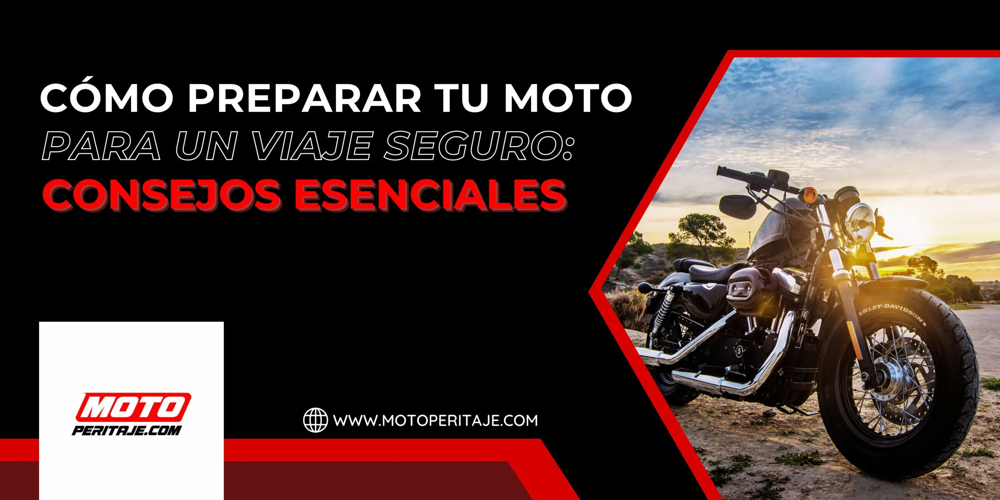
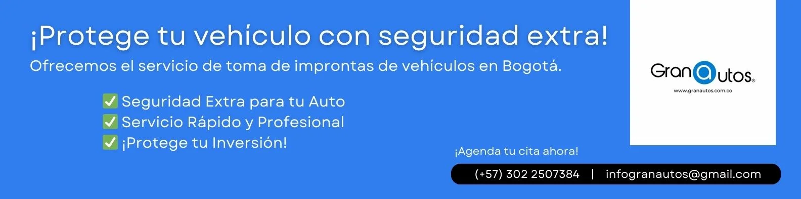

# /blog/

| Campo | Valor |
|---|---|
| URL | https://motoperitaje.com/blog/ |
| <title> | Blog Especializado en Peritaje de Motos - Moto Peritaje |
| meta description | Bienvenid@ al blog de MOTOPERITAJE tu fuente de información confiable y actualizada sobre evaluación y peritaje de motos. |
| robots | max-image-preview:large |
| canonical | https://motoperitaje.com/blog/ |
| og:locale | es_ES |
| og:site_name | Peritaje de Motos HOY en Bogotá, Sin Cita Previa | Motoperitaje | Peritajes y revision de motos y super motos |
| og:type | article |
| og:title | Blog Especializado en Peritaje de Motos - Moto Peritaje |
| og:description | Bienvenid@ al blog de MOTOPERITAJE tu fuente de información confiable y actualizada sobre evaluación y peritaje de motos. |
| og:url | https://motoperitaje.com/blog/ |
| og:image | https://motoperitaje.com/wp-content/uploads/2026/01/cropped-moto-peritaje-marca.webp |
| og:image:secure_url | https://motoperitaje.com/wp-content/uploads/2026/01/cropped-moto-peritaje-marca.webp |
| article:published_time | 2023-06-01T14:22:04+00:00 |
| article:modified_time | 2026-01-22T16:57:06+00:00 |
| twitter:card | summary |
| twitter:title | Blog Especializado en Peritaje de Motos - Moto Peritaje |
| twitter:description | Bienvenid@ al blog de MOTOPERITAJE tu fuente de información confiable y actualizada sobre evaluación y peritaje de motos. |
| twitter:image | https://motoperitaje.com/wp-content/uploads/2026/01/cropped-moto-peritaje-marca.webp |

WhatsApp: —  
Teléfonos: 3022507384  
YouTube: —

## Contenido en orden de aparición

> `[sección <id>]` = id del contenedor Elementor (sirve para buscar su estilo en css-original/post-*.css con el selector .elementor-element-<id>).


`[sección 87036a8]`

## ¿QUÉ DEBES SABER ANTES DE COMPRAR UNA MOTO USADA EN BOGOTÁ?  _(H1)_


`[sección 68681ec]`

- Inicio
- Precio Peritaje Motos
- Precios a Domicilio
- Peritaje Carros
- Contáctanos
- Blog
- Inicio
- Precio Peritaje Motos
- Precios a Domicilio
- Peritaje Carros
- Contáctanos
- Blog

`[sección 9015e92]`

#### CONOCE NUESTRO  _(H3)_

### BLOG INFORMATIVO  _(H2)_


`[sección 9d1344e]`

Bienvenid@ al blog de MOTOPERITAJE tu fuente de información confiable y actualizada sobre evaluación y peritaje de motos.


`[sección eb060f6]`

 (enlaza a https://motoperitaje.com/como-preparar-tu-moto-para-un-viaje-seguro-consejos-esenciales/)

 (enlaza a https://motoperitaje.com/iluminando-el-camino-luces-led-para-motos/)


`[sección ea08acf]`

 (enlaza a https://motoperitaje.com/importancia-del-peritaje-de-motos-en-casos-de-accidentes/)

 (enlaza a https://motoperitaje.com/que-tipo-de-informacion-se-recopila-durante-un-peritaje-de-motos/)


`[sección fd1a432]`

 (enlaza a https://motoperitaje.com/que-documentacion-necesito-para-realizar-un-peritaje-de-motos-en-bogota/)

 (enlaza a https://motoperitaje.com/las-marcas-de-motos-mas-populares/)


`[sección 7a9a951]`

 (enlaza a https://motoperitaje.com/como-el-peritaje-revela-su-verdadero-precio-en-el-mercado-de-las-motos/)

 (enlaza a https://motoperitaje.com/todo-lo-que-necesitas-saber-sobre-el-peritaje-de-motos/)


`[sección 4aa2a8a]`

##### HOY SE HABLA DE  _(H4)_

- Consejos de seguridad
- Equipo de Protección
- Peritaje de Motos
- Historia de las motos
- Motos Eléctricas
- Deportes de Motociclismo
- Mantenimiento de Motos
##### MARCAS DE MOTOS  _(H4)_

- Kawasaki
- Ducati
- BMW
- Honda
- Yamaha
- Suzuki
- KTM
- Aprilia
- Harley-Davidson
- Triumph
##### LO MÁS RECIENTE  _(H4)_


`[sección 927bca9]`

¿Qué documentación necesito para realizar un peritaje de motos en Bogotá?


`[sección 83f67cd]`

Las marcas de motos más populares del mundo


`[sección c887d63]`

Luces LED para motos


`[sección 23b8291]`




`[sección 32870ed]`

##### VER MÁS ARTÍCULOS  _(H4)_


`[sección 38ff180]`

 (enlaza a https://motoperitaje.com/como-el-peritaje-revela-su-verdadero-precio-en-el-mercado-de-las-motos/)

 (enlaza a https://motoperitaje.com/como-el-peritaje-revela-su-verdadero-precio-en-el-mercado-de-las-motos/)

 (enlaza a https://motoperitaje.com/como-el-peritaje-revela-su-verdadero-precio-en-el-mercado-de-las-motos/)

 (enlaza a https://motoperitaje.com/como-el-peritaje-revela-su-verdadero-precio-en-el-mercado-de-las-motos/)

 (enlaza a https://motoperitaje.com/como-el-peritaje-revela-su-verdadero-precio-en-el-mercado-de-las-motos/)


`[sección fc90434]`


`[sección a8a0579]`

###### PREGUNTAS FRECUENTES  _(H5)_

¿Cuál es la marca de motocicletas más icónica del mundo?

La marca de motocicletas más icónica del mundo es Harley-Davidson. Fundada en 1903 en Estados Unidos, esta legendaria compañía es conocida por su estilo distintivo y su fuerte patrimonio en la cultura de las motos.

¿Cuál es la importancia de usar equipo de protección al andar en moto?

El equipo de protección es fundamental para la seguridad de los motociclistas. Incluye casco, chaqueta, pantalones, guantes y botas. Estos elementos protegen al motociclista de lesiones graves en caso de accidente, proporcionando una barrera vital entre el cuerpo y el pavimento.

¿Cuáles son algunos consejos esenciales para mantener tu moto en buen estado?

- Realiza un mantenimiento regular, que incluya cambios de aceite, revisión de frenos y neumáticos, y ajuste de la cadena.
- Limpia y lubrica la cadena periódicamente.
- Verifica regularmente la presión de los neumáticos.
- Almacena tu moto en un lugar seco y seguro.
- Inspecciona las luces y los frenos antes de cada viaje.
¿Cuál es la mejor manera de elegir la motocicleta adecuada?

Elegir la motocicleta adecuada depende de tus necesidades y preferencias personales. Antes de comprar, considera tu nivel de experiencia, el tipo de conducción que planeas hacer (urbana, off-road, deportiva, turismo, etc.), y tu presupuesto. Investiga y realiza pruebas de manejo para encontrar la moto que se adapte mejor a ti.

¿Qué accesorios son esenciales para motociclistas?

Además del equipo de protección básico, algunos accesorios esenciales para motociclistas incluyen:

- Intercomunicadores para comunicación durante el viaje.
- Alforjas o maletas para llevar pertenencias.
- GPS o soporte para teléfono para la navegación.
- Parabrisas o pantalla para mayor protección contra el viento.
¿Cuáles son las marcas de motocicletas más populares en la actualidad?

Algunas de las marcas de motocicletas más populares en la actualidad incluyen Harley-Davidson, Honda, Yamaha, Kawasaki, BMW, Ducati, Suzuki, y KTM, entre otras. La elección de la marca dependerá de tus preferencias personales y necesidades de conducción.

¿Es necesario hacer un curso de conducción para motocicletas?

Sí, se recomienda encarecidamente realizar un curso de conducción para motocicletas, ya que proporciona habilidades esenciales y conocimientos de seguridad que benefician a todos los motociclistas, incluso a los experimentados.

¿Cuáles son los requisitos para obtener la licencia de conducir para motos?

Los requisitos varían según la ubicación, pero generalmente incluyen pasar un examen escrito y práctico, completar un curso de seguridad vial y cumplir con los requisitos de edad.

¿Cómo puedo mejorar la eficiencia de combustible de mi moto?

Mantén la moto bien afinada, infla adecuadamente los neumáticos, utiliza un aceite de motor de calidad y evita aceleraciones y frenadas bruscas para mejorar la eficiencia de combustible.


`[sección 00a2998]`


Copyright 2026 © Moto Peritaje | Todos los derechos reservados


## JSON-LD (schema) original

```json
[
  {
    "@context": "https://schema.org",
    "@graph": [
      {
        "@type": "BreadcrumbList",
        "@id": "https://motoperitaje.com/blog/#breadcrumblist",
        "itemListElement": [
          {
            "@type": "ListItem",
            "@id": "https://motoperitaje.com#listItem",
            "position": 1,
            "name": "Home",
            "item": "https://motoperitaje.com",
            "nextItem": {
              "@type": "ListItem",
              "@id": "https://motoperitaje.com/blog/#listItem",
              "name": "Blog Especializado en Peritaje de Motos &#8211; Moto Peritaje"
            }
          },
          {
            "@type": "ListItem",
            "@id": "https://motoperitaje.com/blog/#listItem",
            "position": 2,
            "name": "Blog Especializado en Peritaje de Motos &#8211; Moto Peritaje",
            "previousItem": {
              "@type": "ListItem",
              "@id": "https://motoperitaje.com#listItem",
              "name": "Home"
            }
          }
        ]
      },
      {
        "@type": "Organization",
        "@id": "https://motoperitaje.com/#organization",
        "name": "Moto Peritaje",
        "description": "Peritaje de motos en Bogotá con expertos certificados. Revisión completa, informe técnico inmediato y sin cita previa. ¡Cotiza tu peritaje hoy en Moto Peritaje! WhatsApp 3022507384",
        "url": "https://motoperitaje.com/",
        "email": "motoperitaje@gmail.com",
        "telephone": "+573022507384",
        "foundingDate": "2023-01-01",
        "logo": {
          "@type": "ImageObject",
          "url": "https://motoperitaje.com/wp-content/uploads/2021/12/27176.png",
          "@id": "https://motoperitaje.com/blog/#organizationLogo",
          "width": 512,
          "height": 512
        },
        "image": {
          "@id": "https://motoperitaje.com/blog/#organizationLogo"
        }
      },
      {
        "@type": "WebPage",
        "@id": "https://motoperitaje.com/blog/#webpage",
        "url": "https://motoperitaje.com/blog/",
        "name": "Blog Especializado en Peritaje de Motos - Moto Peritaje",
        "description": "Bienvenid@ al blog de MOTOPERITAJE tu fuente de información confiable y actualizada sobre evaluación y peritaje de motos.",
        "inLanguage": "es-ES",
        "isPartOf": {
          "@id": "https://motoperitaje.com/#website"
        },
        "breadcrumb": {
          "@id": "https://motoperitaje.com/blog/#breadcrumblist"
        },
        "datePublished": "2023-06-01T14:22:04+00:00",
        "dateModified": "2026-01-22T16:57:06+00:00"
      },
      {
        "@type": "WebSite",
        "@id": "https://motoperitaje.com/#website",
        "url": "https://motoperitaje.com/",
        "name": "Peritaje de Motos HOY en Bogotá 🚀 Sin Cita Previa | Motoperitaje",
        "alternateName": "Peritaje de Motos HOY en Bogotá 🚀 Sin Cita Previa | Motoperitaje",
        "description": "Peritajes y revision de motos y super motos",
        "inLanguage": "es-ES",
        "publisher": {
          "@id": "https://motoperitaje.com/#organization"
        }
      }
    ]
  }
]
```
