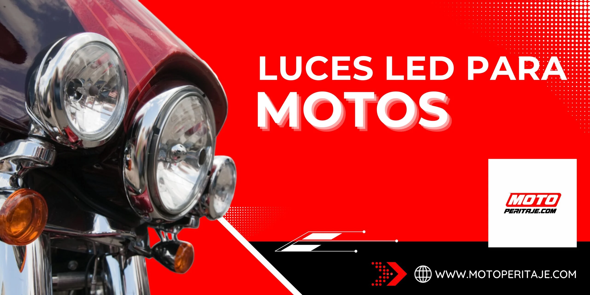

# /iluminando-el-camino-luces-led-para-motos/

| Campo | Valor |
|---|---|
| URL | https://motoperitaje.com/iluminando-el-camino-luces-led-para-motos/ |
| <title> | Luces LED para motos: Más visibilidad y seguridad en la vía |
| meta description | Conoce las ventajas de las luces LED para motos. Mejora tu visibilidad, ahorra energía y viaja con mayor seguridad en cualquier camino. |
| robots | max-image-preview:large |
| canonical | https://motoperitaje.com/iluminando-el-camino-luces-led-para-motos/ |
| og:locale | es_ES |
| og:site_name | Peritaje de Motos HOY en Bogotá, Sin Cita Previa | Motoperitaje | Peritajes y revision de motos y super motos |
| og:type | article |
| og:title | Luces LED para motos: Más visibilidad y seguridad en la vía |
| og:description | Conoce las ventajas de las luces LED para motos. Mejora tu visibilidad, ahorra energía y viaja con mayor seguridad en cualquier camino. |
| og:url | https://motoperitaje.com/iluminando-el-camino-luces-led-para-motos/ |
| og:image | https://motoperitaje.com/wp-content/uploads/2026/01/cropped-moto-peritaje-marca.webp |
| og:image:secure_url | https://motoperitaje.com/wp-content/uploads/2026/01/cropped-moto-peritaje-marca.webp |
| article:published_time | 2023-09-14T14:08:42+00:00 |
| article:modified_time | 2026-01-22T17:39:27+00:00 |
| twitter:card | summary |
| twitter:title | Luces LED para motos: Más visibilidad y seguridad en la vía |
| twitter:description | Conoce las ventajas de las luces LED para motos. Mejora tu visibilidad, ahorra energía y viaja con mayor seguridad en cualquier camino. |
| twitter:image | https://motoperitaje.com/wp-content/uploads/2026/01/cropped-moto-peritaje-marca.webp |

WhatsApp: —  
Teléfonos: 3022507384  
YouTube: —

## Contenido en orden de aparición

> `[sección <id>]` = id del contenedor Elementor (sirve para buscar su estilo en css-original/post-*.css con el selector .elementor-element-<id>).


`[sección e4e258f]`

- Inicio
- Precio Peritaje Motos
- Precios a Domicilio
- Peritaje Carros
- Contáctanos
- Blog
- Inicio
- Precio Peritaje Motos
- Precios a Domicilio
- Peritaje Carros
- Contáctanos
- Blog

`[sección 05fa44a]`



## ILUMINANDO EL CAMINO: LUCES LED PARA MOTOS  _(H1)_

Bienvenidos a nuestro rincón dedicado a la pasión por las dos ruedas y la búsqueda de la seguridad en cada viaje. En el mundo de las motocicletas, la visibilidad es un elemento crucial para garantizar nuestra protección en las carreteras. Las luces LED han revolucionado la forma en que iluminamos nuestros caminos y cómo los demás nos ven.

En este espacio, exploraremos el asombroso mundo de las luces LED para motos, una tecnología que va más allá de la estética y que se convierte en un elemento esencial para nuestra seguridad y disfrute en la conducción. A lo largo de estas páginas, descubriremos por qué estas luces brillantes se han convertido en la elección predilecta de los motociclistas conscientes de la seguridad en todo el mundo.

Desde los faros delanteros que iluminan nuestras rutas hasta las luces de freno y señalización que comunican nuestras intenciones a los demás conductores, exploraremos todos los aspectos de las luces LED para motos.

Luces LED para Motos: Iluminación Brillante, Segura y Versátil

Las luces LED (Light Emitting Diode o Diodo Emisor de Luz) han revolucionado la iluminación en motocicletas. Su secreto radica en su capacidad para producir una luz más brillante y blanca en comparación con las luces convencionales. Esto se traduce en una visibilidad mejorada tanto durante el día como en las noches oscuras.

Durante el día, las luces LED destacan por su intensidad, lo que hace que tu moto sea más visible para otros conductores, peatones y ciclistas. Esta visibilidad adicional reduce el riesgo de colisiones y te mantiene seguro en el tráfico.

En la noche, las luces LED emiten una luz blanca y clara que ilumina el camino de manera más efectiva que las luces tradicionales. Esto te permite ver con mayor claridad los obstáculos, las curvas y las señales de tráfico, brindándote una sensación de confianza y seguridad en tu viaje nocturno.

Eficiencia Energética: Las Luces LED y la Preservación de la Batería de Tu Moto

Cuando se trata de mantener tu moto en perfecto estado, la salud de la batería es esencial. Las luces LED ofrecen una ventaja significativa en este aspecto gracias a su eficiencia energética.

A diferencia de las luces convencionales, las luces LED consumen menos energía para producir una luz igual o incluso más brillante. Esto significa que, al usar luces LED en tu moto, tu batería se ve menos exigida. En consecuencia, la carga de la batería dura más tiempo, lo que es especialmente beneficioso en viajes largos o cuando necesitas encender las luces durante períodos prolongados.

Además, la eficiencia de las luces LED también se traduce en una menor carga sobre el sistema de carga de la moto, lo que contribuye a su longevidad. En resumen, al optar por luces LED, no solo mejoras la visibilidad y seguridad, sino que también prolongas la vida útil de la batería de tu moto.

Así que, la próxima vez que enciendas tus luces LED, recuerda que no solo estás iluminando el camino de manera brillante, sino que también estás ayudando a preservar la carga de tu batería y a mantener tu moto lista para la próxima aventura.

Cómo Limpiar y Cuidar tus Luces LED para Motocicletas

Las luces LED son conocidas por su brillo y durabilidad, pero para mantenerlas en su mejor forma, es importante cuidarlas adecuadamente. Aquí tienes algunos consejos para mantener tus luces LED en óptimas condiciones:

1. Limpieza Regular: Limpia tus luces LED de motocicleta regularmente para eliminar el polvo, la suciedad y los insectos que puedan acumularse. Utiliza un paño suave y húmedo o un limpiador de lentes no abrasivo. Evita los productos químicos agresivos que puedan dañar la superficie.

2. Inspección Visual: Realiza inspecciones visuales periódicas para detectar cualquier signo de daño o desgaste en las luces y sus conexiones. Esto te permitirá abordar problemas potenciales antes de que se conviertan en un inconveniente.

3. Protección UV: Si es posible, estaciona tu moto en un lugar con sombra o utiliza fundas que protejan las luces LED de la exposición prolongada a los rayos UV. Esto ayudará a prevenir la decoloración o el daño de la carcasa.

4. Evita el Agua Estancada: Evita que el agua estancada se acumule alrededor de las luces, ya que puede infiltrarse en las conexiones y dañar los componentes internos. Mantén los sellos de goma en buen estado para evitar filtraciones.

5. Comprueba la Fijación: Asegúrate de que las luces LED estén bien aseguradas en su lugar y que no estén flojas o vibrando mientras conduces. Las vibraciones excesivas pueden dañar los componentes internos con el tiempo.


### SERVICIOS RELACIONADOS  _(H2)_


`[sección 25dd401]`

Servicio de peritaje de vehículos en bogotá.

www.granautos.com.co/sala


`[sección 1f219b0]`

Servicio de peritaje de vehículos a domicilio.

www.granautos.com.co/domicilio


`[sección 910873c]`


Copyright 2026 © Moto Peritaje | Todos los derechos reservados


## JSON-LD (schema) original

```json
[
  {
    "@context": "https://schema.org",
    "@graph": [
      {
        "@type": "BlogPosting",
        "@id": "https://motoperitaje.com/iluminando-el-camino-luces-led-para-motos/#blogposting",
        "name": "Luces LED para motos: Más visibilidad y seguridad en la vía",
        "headline": "Iluminando el Camino: Luces LED para Motos",
        "author": {
          "@id": "https://motoperitaje.com/author/admin/#author"
        },
        "publisher": {
          "@id": "https://motoperitaje.com/#organization"
        },
        "image": {
          "@type": "ImageObject",
          "url": "https://motoperitaje.com/wp-content/uploads/2024/05/luces-led-para-motos.webp",
          "@id": "https://motoperitaje.com/iluminando-el-camino-luces-led-para-motos/#articleImage",
          "width": 2560,
          "height": 1280,
          "caption": "luces led para motos"
        },
        "datePublished": "2023-09-14T14:08:42+00:00",
        "dateModified": "2026-01-22T17:39:27+00:00",
        "inLanguage": "es-ES",
        "mainEntityOfPage": {
          "@id": "https://motoperitaje.com/iluminando-el-camino-luces-led-para-motos/#webpage"
        },
        "isPartOf": {
          "@id": "https://motoperitaje.com/iluminando-el-camino-luces-led-para-motos/#webpage"
        },
        "articleSection": "Uncategorized"
      },
      {
        "@type": "BreadcrumbList",
        "@id": "https://motoperitaje.com/iluminando-el-camino-luces-led-para-motos/#breadcrumblist",
        "itemListElement": [
          {
            "@type": "ListItem",
            "@id": "https://motoperitaje.com#listItem",
            "position": 1,
            "name": "Home",
            "item": "https://motoperitaje.com",
            "nextItem": {
              "@type": "ListItem",
              "@id": "https://motoperitaje.com/category/uncategorized/#listItem",
              "name": "Uncategorized"
            }
          },
          {
            "@type": "ListItem",
            "@id": "https://motoperitaje.com/category/uncategorized/#listItem",
            "position": 2,
            "name": "Uncategorized",
            "item": "https://motoperitaje.com/category/uncategorized/",
            "nextItem": {
              "@type": "ListItem",
              "@id": "https://motoperitaje.com/iluminando-el-camino-luces-led-para-motos/#listItem",
              "name": "Iluminando el Camino: Luces LED para Motos"
            },
            "previousItem": {
              "@type": "ListItem",
              "@id": "https://motoperitaje.com#listItem",
              "name": "Home"
            }
          },
          {
            "@type": "ListItem",
            "@id": "https://motoperitaje.com/iluminando-el-camino-luces-led-para-motos/#listItem",
            "position": 3,
            "name": "Iluminando el Camino: Luces LED para Motos",
            "previousItem": {
              "@type": "ListItem",
              "@id": "https://motoperitaje.com/category/uncategorized/#listItem",
              "name": "Uncategorized"
            }
          }
        ]
      },
      {
        "@type": "Organization",
        "@id": "https://motoperitaje.com/#organization",
        "name": "Moto Peritaje",
        "description": "Peritaje de motos en Bogotá con expertos certificados. Revisión completa, informe técnico inmediato y sin cita previa. ¡Cotiza tu peritaje hoy en Moto Peritaje! WhatsApp 3022507384",
        "url": "https://motoperitaje.com/",
        "email": "motoperitaje@gmail.com",
        "telephone": "+573022507384",
        "foundingDate": "2023-01-01",
        "logo": {
          "@type": "ImageObject",
          "url": "https://motoperitaje.com/wp-content/uploads/2021/12/27176.png",
          "@id": "https://motoperitaje.com/iluminando-el-camino-luces-led-para-motos/#organizationLogo",
          "width": 512,
          "height": 512
        },
        "image": {
          "@id": "https://motoperitaje.com/iluminando-el-camino-luces-led-para-motos/#organizationLogo"
        }
      },
      {
        "@type": "Person",
        "@id": "https://motoperitaje.com/author/admin/#author",
        "url": "https://motoperitaje.com/author/admin/",
        "name": "admin",
        "image": {
          "@type": "ImageObject",
          "@id": "https://motoperitaje.com/iluminando-el-camino-luces-led-para-motos/#authorImage",
          "url": "https://secure.gravatar.com/avatar/7254071fca2e6fce54eefc61f5b4958b8c3021dba9a37b1598636a1288e6b539?s=96&d=mm&r=g",
          "width": 96,
          "height": 96,
          "caption": "admin"
        }
      },
      {
        "@type": "WebPage",
        "@id": "https://motoperitaje.com/iluminando-el-camino-luces-led-para-motos/#webpage",
        "url": "https://motoperitaje.com/iluminando-el-camino-luces-led-para-motos/",
        "name": "Luces LED para motos: Más visibilidad y seguridad en la vía",
        "description": "Conoce las ventajas de las luces LED para motos. Mejora tu visibilidad, ahorra energía y viaja con mayor seguridad en cualquier camino.",
        "inLanguage": "es-ES",
        "isPartOf": {
          "@id": "https://motoperitaje.com/#website"
        },
        "breadcrumb": {
          "@id": "https://motoperitaje.com/iluminando-el-camino-luces-led-para-motos/#breadcrumblist"
        },
        "author": {
          "@id": "https://motoperitaje.com/author/admin/#author"
        },
        "creator": {
          "@id": "https://motoperitaje.com/author/admin/#author"
        },
        "datePublished": "2023-09-14T14:08:42+00:00",
        "dateModified": "2026-01-22T17:39:27+00:00"
      },
      {
        "@type": "WebSite",
        "@id": "https://motoperitaje.com/#website",
        "url": "https://motoperitaje.com/",
        "name": "Peritaje de Motos HOY en Bogotá 🚀 Sin Cita Previa | Motoperitaje",
        "alternateName": "Peritaje de Motos HOY en Bogotá 🚀 Sin Cita Previa | Motoperitaje",
        "description": "Peritajes y revision de motos y super motos",
        "inLanguage": "es-ES",
        "publisher": {
          "@id": "https://motoperitaje.com/#organization"
        }
      }
    ]
  }
]
```
