# /las-marcas-de-motos-mas-populares/

| Campo | Valor |
|---|---|
| URL | https://motoperitaje.com/las-marcas-de-motos-mas-populares/ |
| <title> | Las marcas de motos más populares y confiables en 2026 | Motoperitaje |
| meta description | Conoce las marcas de motos más populares del mundo. Descubre su historia, modelos destacados y cuál se adapta mejor a tu estilo de conducción. |
| robots | max-image-preview:large |
| canonical | https://motoperitaje.com/las-marcas-de-motos-mas-populares/ |
| og:locale | es_ES |
| og:site_name | Peritaje de Motos HOY en Bogotá, Sin Cita Previa | Motoperitaje | Peritajes y revision de motos y super motos |
| og:type | article |
| og:title | Las marcas de motos más populares y confiables en 2026 | Motoperitaje |
| og:description | Conoce las marcas de motos más populares del mundo. Descubre su historia, modelos destacados y cuál se adapta mejor a tu estilo de conducción. |
| og:url | https://motoperitaje.com/las-marcas-de-motos-mas-populares/ |
| og:image | https://motoperitaje.com/wp-content/uploads/2026/01/cropped-moto-peritaje-marca.webp |
| og:image:secure_url | https://motoperitaje.com/wp-content/uploads/2026/01/cropped-moto-peritaje-marca.webp |
| article:published_time | 2023-09-28T13:28:32+00:00 |
| article:modified_time | 2026-01-22T17:39:50+00:00 |
| twitter:card | summary |
| twitter:title | Las marcas de motos más populares y confiables en 2026 | Motoperitaje |
| twitter:description | Conoce las marcas de motos más populares del mundo. Descubre su historia, modelos destacados y cuál se adapta mejor a tu estilo de conducción. |
| twitter:image | https://motoperitaje.com/wp-content/uploads/2026/01/cropped-moto-peritaje-marca.webp |

WhatsApp: —  
Teléfonos: 3022507384  
YouTube: —

## Contenido en orden de aparición

> `[sección <id>]` = id del contenedor Elementor (sirve para buscar su estilo en css-original/post-*.css con el selector .elementor-element-<id>).


`[sección 0ad92ec]`

- Inicio
- Precio Peritaje Motos
- Precios a Domicilio
- Peritaje Carros
- Contáctanos
- Blog
- Inicio
- Precio Peritaje Motos
- Precios a Domicilio
- Peritaje Carros
- Contáctanos
- Blog

`[sección cc4bd3c]`

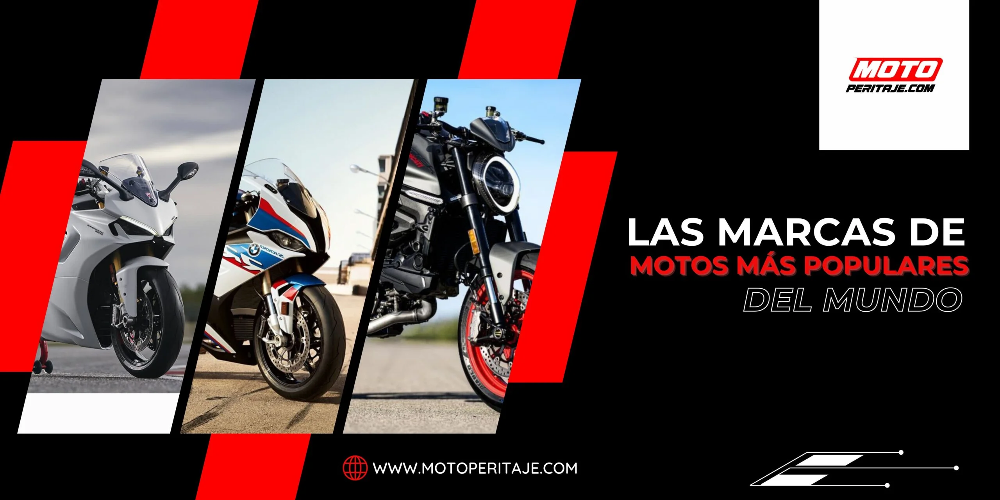

## DESCUBRE LAS MARCAS DE MOTOS MÁS POPULARES DEL MUNDO  _(H1)_

Explora el emocionante mundo de las marcas de motos más reconocidas globalmente. Desde las icónicas Harley-Davidson hasta las poderosas Ducati, nuestro blog ofrece una guía completa con información detallada sobre cada marca, modelos emblemáticos y las últimas innovaciones en la industria de las motocicletas.


`[sección cc2a94c]`

### Harley-Davidson:  _(H2)_

Esta icónica marca estadounidense es conocida por sus motos de crucero de estilo clásico. Fundada en 1903, Harley-Davidson ha mantenido una base de seguidores leales y es símbolo de la cultura de las motos en los Estados Unidos.


`[sección e78b3b2]`

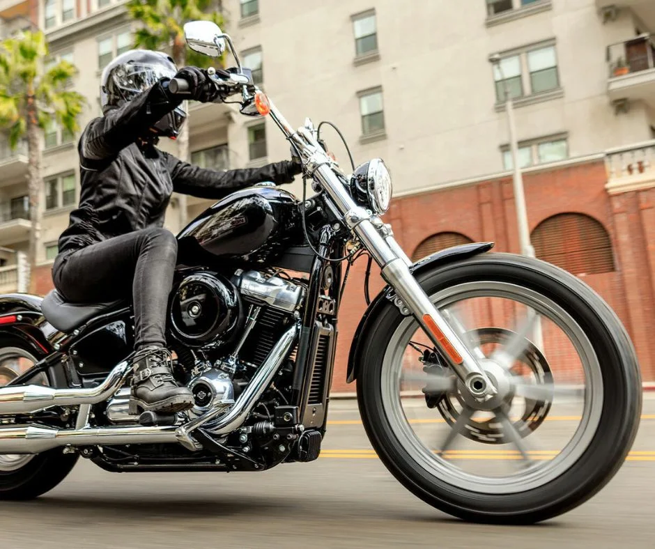

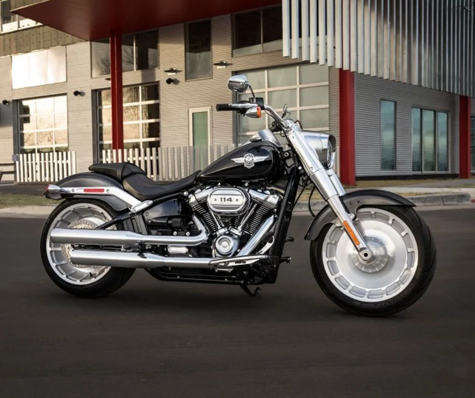


`[sección 0c21186]`

### Honda:  _(H2)_

Honda es una de las marcas de motocicletas más grandes y reconocidas del mundo. Ofrecen una amplia gama de modelos, desde motos deportivas hasta scooters y motos de aventura. Son conocidos por su confiabilidad y tecnología innovadora.


`[sección 1e05612]`

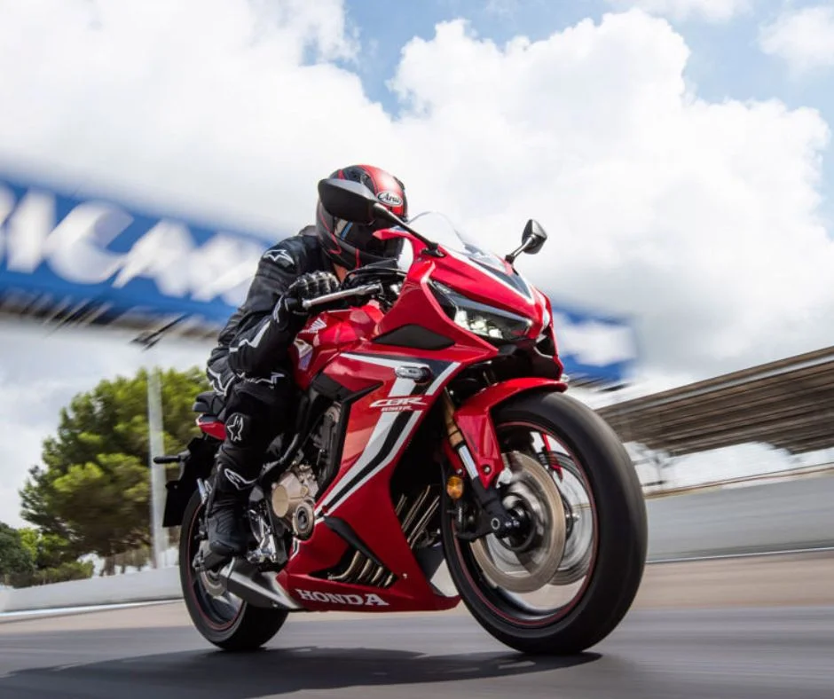

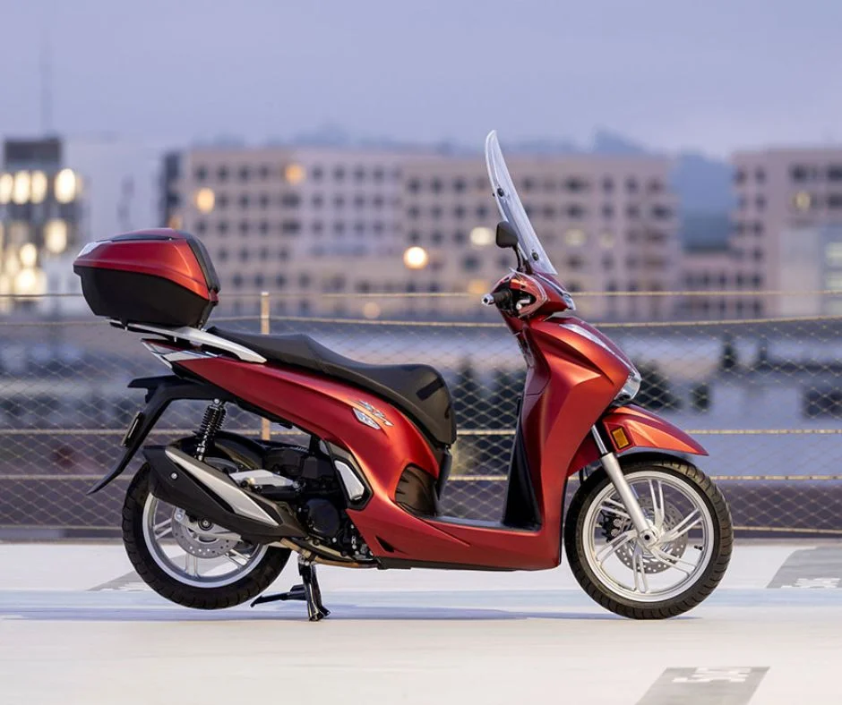


`[sección ea56927]`

### Ducati:  _(H2)_

Esta marca italiana es famosa por sus motos deportivas de alto rendimiento. Ducati ha ganado numerosos campeonatos en competiciones de motociclismo y es admirada por su diseño elegante y tecnología avanzada.


`[sección f2e2382]`

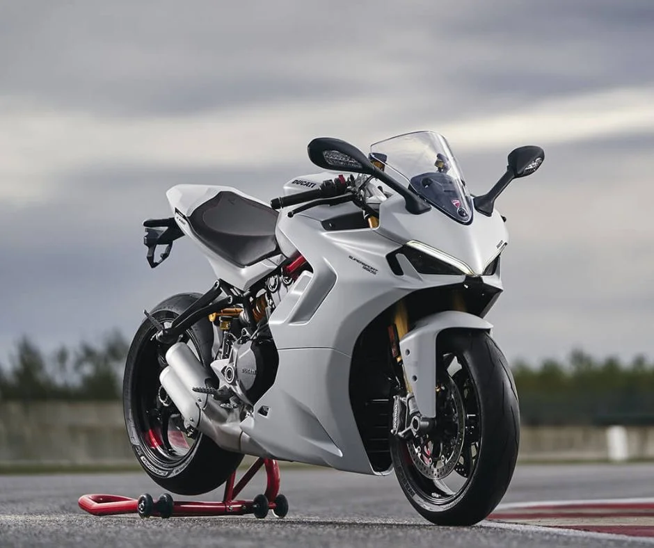

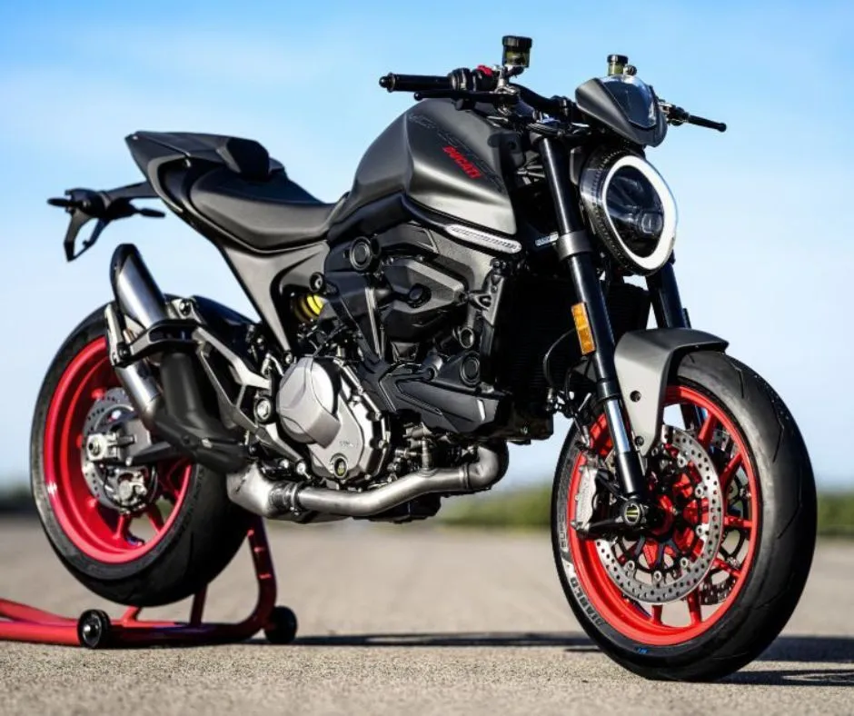


`[sección 5226ce7]`

### Kawasaki:  _(H2)_

Kawasaki es otra marca japonesa con una sólida presencia en el mercado de las motocicletas. Ofrecen una amplia gama de modelos, desde motos deportivas hasta motos de cross y crucero. Son conocidos por su potencia y rendimiento.


`[sección 9ac4bca]`

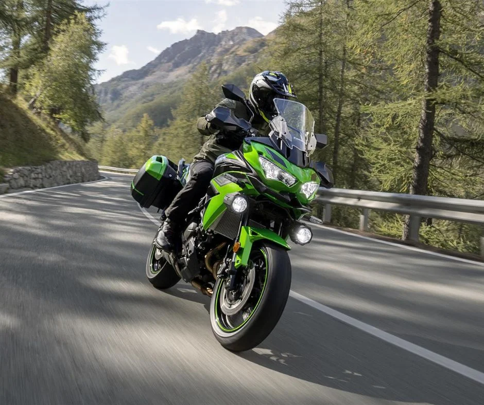

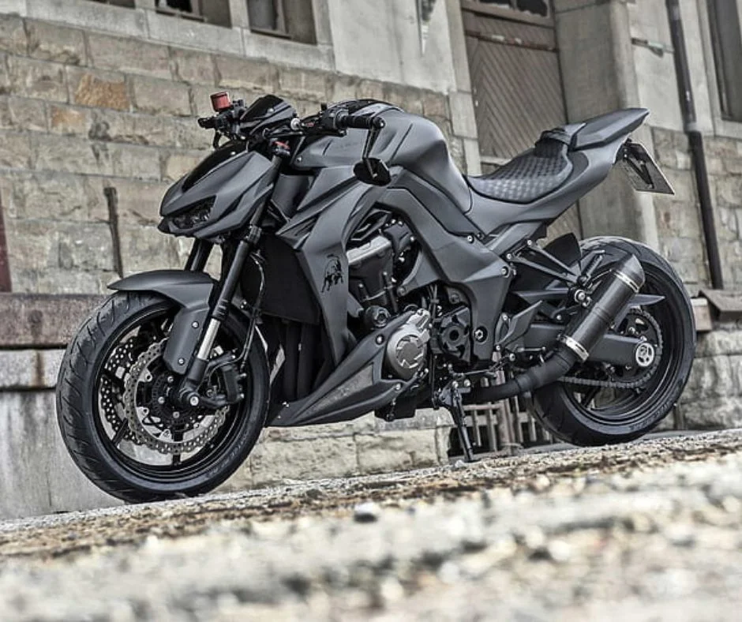


`[sección 9f92214]`

### BMW Motorrad:  _(H2)_

La división de motocicletas de BMW es conocida por su enfoque en la calidad y la tecnología. Ofrecen motos de turismo, aventura y deportivas, y son populares entre los entusiastas de los viajes largos.


`[sección 0f7354e]`

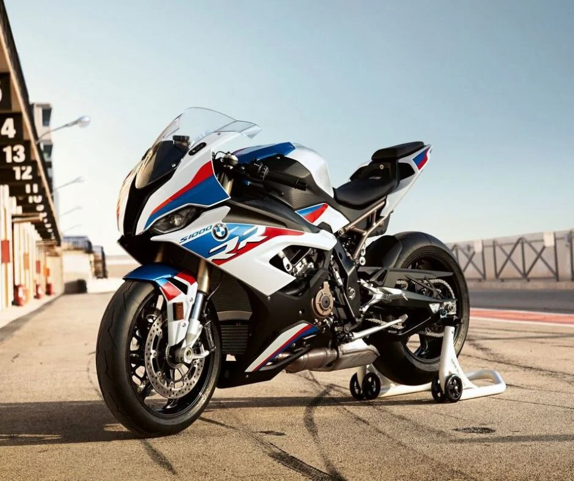

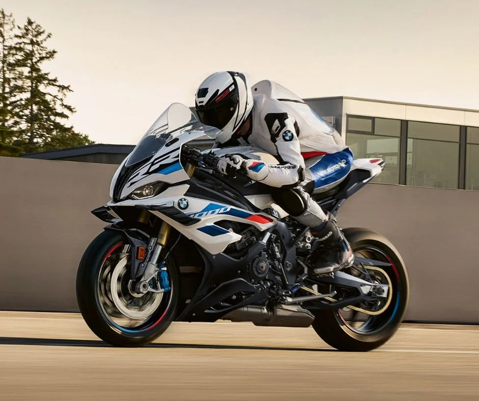


`[sección cc4bd3c]`


#### SERVICIOS RELACIONADOS  _(H3)_


`[sección 4f54020]`

Servicio de peritaje de vehículos en bogotá.

www.granautos.com.co/sala


`[sección cb67aee]`


Servicio de peritaje de vehículos a domicilio.

www.granautos.com.co/domicilio


`[sección 1ca2aa2]`


Copyright 2026 © Moto Peritaje | Todos los derechos reservados


## JSON-LD (schema) original

```json
[
  {
    "@context": "https://schema.org",
    "@graph": [
      {
        "@type": "BlogPosting",
        "@id": "https://motoperitaje.com/las-marcas-de-motos-mas-populares/#blogposting",
        "name": "Las marcas de motos más populares y confiables en 2026 | Motoperitaje",
        "headline": "Las marcas de motos más populares",
        "author": {
          "@id": "https://motoperitaje.com/author/admin/#author"
        },
        "publisher": {
          "@id": "https://motoperitaje.com/#organization"
        },
        "image": {
          "@type": "ImageObject",
          "url": "https://motoperitaje.com/wp-content/uploads/2024/05/LAS-MARCAS-DE-MOTOS-MAS-POPULARES-DEL-MUNDO.webp",
          "@id": "https://motoperitaje.com/las-marcas-de-motos-mas-populares/#articleImage",
          "width": 2560,
          "height": 1280,
          "caption": "LAS MARCAS DE MOTOS MÁS POPULARES DEL MUNDO"
        },
        "datePublished": "2023-09-28T13:28:32+00:00",
        "dateModified": "2026-01-22T17:39:50+00:00",
        "inLanguage": "es-ES",
        "mainEntityOfPage": {
          "@id": "https://motoperitaje.com/las-marcas-de-motos-mas-populares/#webpage"
        },
        "isPartOf": {
          "@id": "https://motoperitaje.com/las-marcas-de-motos-mas-populares/#webpage"
        },
        "articleSection": "Uncategorized"
      },
      {
        "@type": "BreadcrumbList",
        "@id": "https://motoperitaje.com/las-marcas-de-motos-mas-populares/#breadcrumblist",
        "itemListElement": [
          {
            "@type": "ListItem",
            "@id": "https://motoperitaje.com#listItem",
            "position": 1,
            "name": "Home",
            "item": "https://motoperitaje.com",
            "nextItem": {
              "@type": "ListItem",
              "@id": "https://motoperitaje.com/category/uncategorized/#listItem",
              "name": "Uncategorized"
            }
          },
          {
            "@type": "ListItem",
            "@id": "https://motoperitaje.com/category/uncategorized/#listItem",
            "position": 2,
            "name": "Uncategorized",
            "item": "https://motoperitaje.com/category/uncategorized/",
            "nextItem": {
              "@type": "ListItem",
              "@id": "https://motoperitaje.com/las-marcas-de-motos-mas-populares/#listItem",
              "name": "Las marcas de motos más populares"
            },
            "previousItem": {
              "@type": "ListItem",
              "@id": "https://motoperitaje.com#listItem",
              "name": "Home"
            }
          },
          {
            "@type": "ListItem",
            "@id": "https://motoperitaje.com/las-marcas-de-motos-mas-populares/#listItem",
            "position": 3,
            "name": "Las marcas de motos más populares",
            "previousItem": {
              "@type": "ListItem",
              "@id": "https://motoperitaje.com/category/uncategorized/#listItem",
              "name": "Uncategorized"
            }
          }
        ]
      },
      {
        "@type": "Organization",
        "@id": "https://motoperitaje.com/#organization",
        "name": "Moto Peritaje",
        "description": "Peritaje de motos en Bogotá con expertos certificados. Revisión completa, informe técnico inmediato y sin cita previa. ¡Cotiza tu peritaje hoy en Moto Peritaje! WhatsApp 3022507384",
        "url": "https://motoperitaje.com/",
        "email": "motoperitaje@gmail.com",
        "telephone": "+573022507384",
        "foundingDate": "2023-01-01",
        "logo": {
          "@type": "ImageObject",
          "url": "https://motoperitaje.com/wp-content/uploads/2021/12/27176.png",
          "@id": "https://motoperitaje.com/las-marcas-de-motos-mas-populares/#organizationLogo",
          "width": 512,
          "height": 512
        },
        "image": {
          "@id": "https://motoperitaje.com/las-marcas-de-motos-mas-populares/#organizationLogo"
        }
      },
      {
        "@type": "Person",
        "@id": "https://motoperitaje.com/author/admin/#author",
        "url": "https://motoperitaje.com/author/admin/",
        "name": "admin",
        "image": {
          "@type": "ImageObject",
          "@id": "https://motoperitaje.com/las-marcas-de-motos-mas-populares/#authorImage",
          "url": "https://secure.gravatar.com/avatar/7254071fca2e6fce54eefc61f5b4958b8c3021dba9a37b1598636a1288e6b539?s=96&d=mm&r=g",
          "width": 96,
          "height": 96,
          "caption": "admin"
        }
      },
      {
        "@type": "WebPage",
        "@id": "https://motoperitaje.com/las-marcas-de-motos-mas-populares/#webpage",
        "url": "https://motoperitaje.com/las-marcas-de-motos-mas-populares/",
        "name": "Las marcas de motos más populares y confiables en 2026 | Motoperitaje",
        "description": "Conoce las marcas de motos más populares del mundo. Descubre su historia, modelos destacados y cuál se adapta mejor a tu estilo de conducción.",
        "inLanguage": "es-ES",
        "isPartOf": {
          "@id": "https://motoperitaje.com/#website"
        },
        "breadcrumb": {
          "@id": "https://motoperitaje.com/las-marcas-de-motos-mas-populares/#breadcrumblist"
        },
        "author": {
          "@id": "https://motoperitaje.com/author/admin/#author"
        },
        "creator": {
          "@id": "https://motoperitaje.com/author/admin/#author"
        },
        "datePublished": "2023-09-28T13:28:32+00:00",
        "dateModified": "2026-01-22T17:39:50+00:00"
      },
      {
        "@type": "WebSite",
        "@id": "https://motoperitaje.com/#website",
        "url": "https://motoperitaje.com/",
        "name": "Peritaje de Motos HOY en Bogotá 🚀 Sin Cita Previa | Motoperitaje",
        "alternateName": "Peritaje de Motos HOY en Bogotá 🚀 Sin Cita Previa | Motoperitaje",
        "description": "Peritajes y revision de motos y super motos",
        "inLanguage": "es-ES",
        "publisher": {
          "@id": "https://motoperitaje.com/#organization"
        }
      }
    ]
  }
]
```
