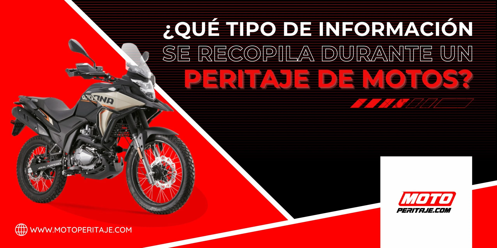

# /que-tipo-de-informacion-se-recopila-durante-un-peritaje-de-motos/

| Campo | Valor |
|---|---|
| URL | https://motoperitaje.com/que-tipo-de-informacion-se-recopila-durante-un-peritaje-de-motos/ |
| <title> | ¿Qué se analiza en un peritaje de motos? Información clave 2026 |
| meta description | Descubre qué datos se recopilan en un peritaje de motos: estado mecánico, chasis, documentos y más. Entiende cada parte del proceso paso a paso. |
| robots | max-image-preview:large |
| canonical | https://motoperitaje.com/que-tipo-de-informacion-se-recopila-durante-un-peritaje-de-motos/ |
| og:locale | es_ES |
| og:site_name | Peritaje de Motos HOY en Bogotá, Sin Cita Previa | Motoperitaje | Peritajes y revision de motos y super motos |
| og:type | article |
| og:title | ¿Qué se analiza en un peritaje de motos? Información clave 2026 |
| og:description | Descubre qué datos se recopilan en un peritaje de motos: estado mecánico, chasis, documentos y más. Entiende cada parte del proceso paso a paso. |
| og:url | https://motoperitaje.com/que-tipo-de-informacion-se-recopila-durante-un-peritaje-de-motos/ |
| og:image | https://motoperitaje.com/wp-content/uploads/2026/01/cropped-moto-peritaje-marca.webp |
| og:image:secure_url | https://motoperitaje.com/wp-content/uploads/2026/01/cropped-moto-peritaje-marca.webp |
| article:published_time | 2023-06-01T15:06:11+00:00 |
| article:modified_time | 2026-01-22T17:42:57+00:00 |
| twitter:card | summary |
| twitter:title | ¿Qué se analiza en un peritaje de motos? Información clave 2026 |
| twitter:description | Descubre qué datos se recopilan en un peritaje de motos: estado mecánico, chasis, documentos y más. Entiende cada parte del proceso paso a paso. |
| twitter:image | https://motoperitaje.com/wp-content/uploads/2026/01/cropped-moto-peritaje-marca.webp |

WhatsApp: —  
Teléfonos: 3022507384  
YouTube: —

## Contenido en orden de aparición

> `[sección <id>]` = id del contenedor Elementor (sirve para buscar su estilo en css-original/post-*.css con el selector .elementor-element-<id>).


`[sección 2b8d7d6]`

- Inicio
- Precio Peritaje Motos
- Precios a Domicilio
- Peritaje Carros
- Contáctanos
- Blog
- Inicio
- Precio Peritaje Motos
- Precios a Domicilio
- Peritaje Carros
- Contáctanos
- Blog

`[sección 06352b9]`



## ¿QUÉ TIPO DE INFORMACIÓN SE RECOPILA DURANTE UN PERITAJE DE MOTOS?  _(H1)_

Un peritaje de motos es un proceso minucioso y detallado que busca recopilar información esencial para comprender las circunstancias de un accidente, evaluar los daños y determinar las responsabilidades involucradas. Durante este proceso, los peritos de motos recopilan una amplia gama de datos y evidencias que son fundamentales para brindar una visión completa y precisa del incidente. A continuación, se detalla el tipo de información que se recopila durante un peritaje de motos:

1. Datos del accidente:

Los peritos de motos recopilan información sobre el lugar, la fecha y la hora exacta del accidente. Esto incluye datos sobre las condiciones climáticas, el estado de la carretera, la iluminación y cualquier otro factor relevante en el momento del incidente.

2. Testimonios de testigos:

Los peritos entrevistan a testigos presenciales del accidente, tanto conductores como peatones, para recopilar testimonios sobre lo que presenciaron. Estos testimonios pueden proporcionar información valiosa sobre cómo ocurrió el accidente y ayudar a reconstruir los eventos.

3. Inspección de la motocicleta:

Los peritos examinan detenidamente la moto involucrada en el accidente para evaluar los daños y determinar si hay componentes defectuosos o fallas mecánicas que puedan haber contribuido al incidente. Se toman fotografías y se documenta el estado de la moto antes y después del accidente.

4. Análisis de la escena del accidente:

Los peritos inspeccionan la escena del accidente en busca de indicios que puedan proporcionar pistas sobre la causa y las circunstancias del accidente. Esto incluye el examen de marcas de frenado, huellas de neumáticos, daños en las estructuras cercanas y cualquier otro detalle relevante.


### SERVICIOS RELACIONADOS  _(H2)_


`[sección 071b65b]`

Servicio de peritaje de vehículos en bogotá.

www.granautos.com.co/sala


`[sección 044f746]`

Servicio de peritaje de vehículos a domicilio.

www.granautos.com.co/domicilio


`[sección dd6c1b7]`


Copyright 2026 © Moto Peritaje | Todos los derechos reservados


## JSON-LD (schema) original

```json
[
  {
    "@context": "https://schema.org",
    "@graph": [
      {
        "@type": "BlogPosting",
        "@id": "https://motoperitaje.com/que-tipo-de-informacion-se-recopila-durante-un-peritaje-de-motos/#blogposting",
        "name": "¿Qué se analiza en un peritaje de motos? Información clave 2026",
        "headline": "¿Qué tipo de información se recopila durante un peritaje de motos?",
        "author": {
          "@id": "https://motoperitaje.com/author/admin/#author"
        },
        "publisher": {
          "@id": "https://motoperitaje.com/#organization"
        },
        "image": {
          "@type": "ImageObject",
          "url": "https://motoperitaje.com/wp-content/uploads/2024/05/que-tipo-de-informacion-se-recopila-durante-un-peritaje-de-motos.webp",
          "@id": "https://motoperitaje.com/que-tipo-de-informacion-se-recopila-durante-un-peritaje-de-motos/#articleImage",
          "width": 2560,
          "height": 1280,
          "caption": "que tipo de informacion se recopila durante un peritaje de motos"
        },
        "datePublished": "2023-06-01T15:06:11+00:00",
        "dateModified": "2026-01-22T17:42:57+00:00",
        "inLanguage": "es-ES",
        "mainEntityOfPage": {
          "@id": "https://motoperitaje.com/que-tipo-de-informacion-se-recopila-durante-un-peritaje-de-motos/#webpage"
        },
        "isPartOf": {
          "@id": "https://motoperitaje.com/que-tipo-de-informacion-se-recopila-durante-un-peritaje-de-motos/#webpage"
        },
        "articleSection": "Uncategorized"
      },
      {
        "@type": "BreadcrumbList",
        "@id": "https://motoperitaje.com/que-tipo-de-informacion-se-recopila-durante-un-peritaje-de-motos/#breadcrumblist",
        "itemListElement": [
          {
            "@type": "ListItem",
            "@id": "https://motoperitaje.com#listItem",
            "position": 1,
            "name": "Home",
            "item": "https://motoperitaje.com",
            "nextItem": {
              "@type": "ListItem",
              "@id": "https://motoperitaje.com/category/uncategorized/#listItem",
              "name": "Uncategorized"
            }
          },
          {
            "@type": "ListItem",
            "@id": "https://motoperitaje.com/category/uncategorized/#listItem",
            "position": 2,
            "name": "Uncategorized",
            "item": "https://motoperitaje.com/category/uncategorized/",
            "nextItem": {
              "@type": "ListItem",
              "@id": "https://motoperitaje.com/que-tipo-de-informacion-se-recopila-durante-un-peritaje-de-motos/#listItem",
              "name": "¿Qué tipo de información se recopila durante un peritaje de motos?"
            },
            "previousItem": {
              "@type": "ListItem",
              "@id": "https://motoperitaje.com#listItem",
              "name": "Home"
            }
          },
          {
            "@type": "ListItem",
            "@id": "https://motoperitaje.com/que-tipo-de-informacion-se-recopila-durante-un-peritaje-de-motos/#listItem",
            "position": 3,
            "name": "¿Qué tipo de información se recopila durante un peritaje de motos?",
            "previousItem": {
              "@type": "ListItem",
              "@id": "https://motoperitaje.com/category/uncategorized/#listItem",
              "name": "Uncategorized"
            }
          }
        ]
      },
      {
        "@type": "Organization",
        "@id": "https://motoperitaje.com/#organization",
        "name": "Moto Peritaje",
        "description": "Peritaje de motos en Bogotá con expertos certificados. Revisión completa, informe técnico inmediato y sin cita previa. ¡Cotiza tu peritaje hoy en Moto Peritaje! WhatsApp 3022507384",
        "url": "https://motoperitaje.com/",
        "email": "motoperitaje@gmail.com",
        "telephone": "+573022507384",
        "foundingDate": "2023-01-01",
        "logo": {
          "@type": "ImageObject",
          "url": "https://motoperitaje.com/wp-content/uploads/2021/12/27176.png",
          "@id": "https://motoperitaje.com/que-tipo-de-informacion-se-recopila-durante-un-peritaje-de-motos/#organizationLogo",
          "width": 512,
          "height": 512
        },
        "image": {
          "@id": "https://motoperitaje.com/que-tipo-de-informacion-se-recopila-durante-un-peritaje-de-motos/#organizationLogo"
        }
      },
      {
        "@type": "Person",
        "@id": "https://motoperitaje.com/author/admin/#author",
        "url": "https://motoperitaje.com/author/admin/",
        "name": "admin",
        "image": {
          "@type": "ImageObject",
          "@id": "https://motoperitaje.com/que-tipo-de-informacion-se-recopila-durante-un-peritaje-de-motos/#authorImage",
          "url": "https://secure.gravatar.com/avatar/7254071fca2e6fce54eefc61f5b4958b8c3021dba9a37b1598636a1288e6b539?s=96&d=mm&r=g",
          "width": 96,
          "height": 96,
          "caption": "admin"
        }
      },
      {
        "@type": "WebPage",
        "@id": "https://motoperitaje.com/que-tipo-de-informacion-se-recopila-durante-un-peritaje-de-motos/#webpage",
        "url": "https://motoperitaje.com/que-tipo-de-informacion-se-recopila-durante-un-peritaje-de-motos/",
        "name": "¿Qué se analiza en un peritaje de motos? Información clave 2026",
        "description": "Descubre qué datos se recopilan en un peritaje de motos: estado mecánico, chasis, documentos y más. Entiende cada parte del proceso paso a paso.",
        "inLanguage": "es-ES",
        "isPartOf": {
          "@id": "https://motoperitaje.com/#website"
        },
        "breadcrumb": {
          "@id": "https://motoperitaje.com/que-tipo-de-informacion-se-recopila-durante-un-peritaje-de-motos/#breadcrumblist"
        },
        "author": {
          "@id": "https://motoperitaje.com/author/admin/#author"
        },
        "creator": {
          "@id": "https://motoperitaje.com/author/admin/#author"
        },
        "datePublished": "2023-06-01T15:06:11+00:00",
        "dateModified": "2026-01-22T17:42:57+00:00"
      },
      {
        "@type": "WebSite",
        "@id": "https://motoperitaje.com/#website",
        "url": "https://motoperitaje.com/",
        "name": "Peritaje de Motos HOY en Bogotá 🚀 Sin Cita Previa | Motoperitaje",
        "alternateName": "Peritaje de Motos HOY en Bogotá 🚀 Sin Cita Previa | Motoperitaje",
        "description": "Peritajes y revision de motos y super motos",
        "inLanguage": "es-ES",
        "publisher": {
          "@id": "https://motoperitaje.com/#organization"
        }
      }
    ]
  }
]
```
