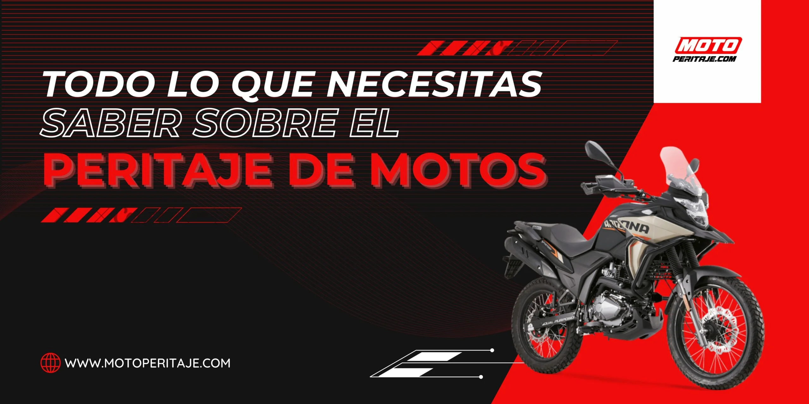
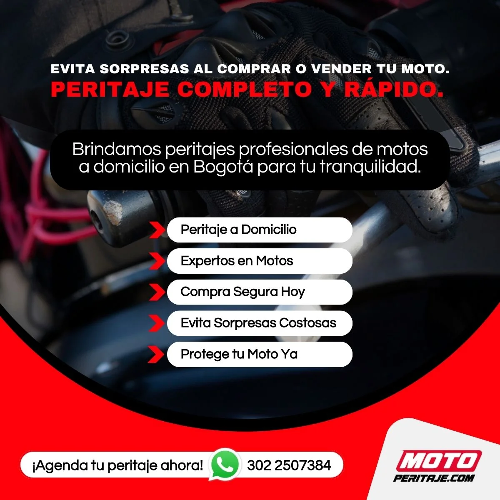

# /todo-lo-que-necesitas-saber-sobre-el-peritaje-de-motos/

| Campo | Valor |
|---|---|
| URL | https://motoperitaje.com/todo-lo-que-necesitas-saber-sobre-el-peritaje-de-motos/ |
| <title> | Peritaje de motos: Todo lo que debes saber antes de comprar o vender |
| meta description | Descubre por qué el peritaje de motos es clave al comprar o vender una usada. Conoce cómo se realiza, qué revisan los expertos y evita fraudes. |
| robots | max-image-preview:large |
| canonical | https://motoperitaje.com/todo-lo-que-necesitas-saber-sobre-el-peritaje-de-motos/ |
| og:locale | es_ES |
| og:site_name | Peritaje de Motos HOY en Bogotá, Sin Cita Previa | Motoperitaje | Peritajes y revision de motos y super motos |
| og:type | article |
| og:title | Peritaje de motos: Todo lo que debes saber antes de comprar o vender |
| og:description | Descubre por qué el peritaje de motos es clave al comprar o vender una usada. Conoce cómo se realiza, qué revisan los expertos y evita fraudes. |
| og:url | https://motoperitaje.com/todo-lo-que-necesitas-saber-sobre-el-peritaje-de-motos/ |
| og:image | https://motoperitaje.com/wp-content/uploads/2026/01/cropped-moto-peritaje-marca.webp |
| og:image:secure_url | https://motoperitaje.com/wp-content/uploads/2026/01/cropped-moto-peritaje-marca.webp |
| article:published_time | 2023-05-25T14:28:54+00:00 |
| article:modified_time | 2026-01-22T17:44:46+00:00 |
| twitter:card | summary |
| twitter:title | Peritaje de motos: Todo lo que debes saber antes de comprar o vender |
| twitter:description | Descubre por qué el peritaje de motos es clave al comprar o vender una usada. Conoce cómo se realiza, qué revisan los expertos y evita fraudes. |
| twitter:image | https://motoperitaje.com/wp-content/uploads/2026/01/cropped-moto-peritaje-marca.webp |

WhatsApp: —  
Teléfonos: 3022507384  
YouTube: —

## Contenido en orden de aparición

> `[sección <id>]` = id del contenedor Elementor (sirve para buscar su estilo en css-original/post-*.css con el selector .elementor-element-<id>).


`[sección 38783ad]`

- Inicio
- Precio Peritaje Motos
- Precios a Domicilio
- Peritaje Carros
- Contáctanos
- Blog
- Inicio
- Precio Peritaje Motos
- Precios a Domicilio
- Peritaje Carros
- Contáctanos
- Blog

`[sección 9c86997]`



## TODO LO QUE NECESITAS SABER SOBRE EL PERITAJE DE MOTOS  _(H1)_

El peritaje de motos es un proceso fundamental cuando se trata de comprar o vender una moto usada, asegurarse de su buen estado o en casos de reclamaciones de seguros. En este artículo, exploraremos en detalle qué es el peritaje de motos, por qué es importante y qué aspectos se evalúan durante este proceso.

Todo lo que necesitas saber sobre el peritaje de motos estará cubierto, desde la inspección minuciosa de los componentes clave hasta la verificación de antecedentes y la documentación necesaria. Si estás interesado en conocer más sobre el tema, ¡sigue leyendo y descubre cómo el peritaje de motos puede brindarte la tranquilidad y seguridad que necesitas en tus transacciones y reclamaciones de seguros!

### ¿Qué es el peritaje de motos?  _(H2)_

El peritaje de motos es una evaluación detallada y profesional de una moto usada, realizada por expertos en el campo. Su objetivo es determinar el estado general de la moto, identificar posibles daños ocultos, verificar la autenticidad de los documentos y estimar su valor real en el mercado.

### Importancia del peritaje de motos:  _(H2)_

1. Garantiza seguridad:

2. Protección en la compra-venta:

3. Reclamaciones de seguros:

1. Garantiza seguridad:

Al realizar un peritaje de motos, se revisan minuciosamente los componentes esenciales como frenos, neumáticos, luces y suspensión para asegurar que la moto esté en condiciones óptimas de seguridad. Esto ayuda a prevenir accidentes y garantiza una conducción segura.

2. Protección en la compra-venta:

Tanto el comprador como el vendedor se benefician del peritaje de motos. El comprador obtiene información detallada sobre el estado de la moto y puede tomar una decisión de compra informada. Por otro lado, el vendedor puede respaldar la calidad de su vehículo y aumentar la confianza del comprador.

3. Reclamaciones de seguros:

En caso de accidentes o daños a la moto, el peritaje de motos es esencial para evaluar los daños y determinar la compensación adecuada por parte de la compañía de seguros. Un peritaje exhaustivo ayuda a evitar disputas y asegura una indemnización justa.


`[sección 7f14ad9]`

### Aspectos evaluados durante el peritaje de motos:  _(H2)_


`[sección 9c86997]`

Durante el proceso de peritaje de motos, se evalúan varios aspectos clave, entre ellos:

- Estado mecánico: Se revisan el motor, la transmisión, el sistema de escape y otros componentes relacionados para verificar su funcionamiento adecuado.
- Carenajes y pintura: Se examina la carrocería en busca de daños, abolladuras, rayones y se verifica el estado de la pintura.
- Documentación y legalidad: Se verifica la autenticidad de los documentos de la moto, como la matrícula, el seguro obligatorio y el historial de mantenimiento.
- Desgaste y kilometraje: Se evalúa el desgaste de los neumáticos, frenos, embrague y otros componentes clave. Además, se verifica el kilometraje y se compara con el estado general de la moto.


#### SERVICIOS RELACIONADOS  _(H3)_


`[sección b15ebc8]`

Servicio de peritaje de vehículos en bogotá.

www.granautos.com.co/sala


`[sección 81e3ffc]`

Servicio de peritaje de vehículos a domicilio.

www.granautos.com.co/domicilio


`[sección 38c3a71]`


Copyright 2026 © Moto Peritaje | Todos los derechos reservados


## JSON-LD (schema) original

```json
[
  {
    "@context": "https://schema.org",
    "@graph": [
      {
        "@type": "BlogPosting",
        "@id": "https://motoperitaje.com/todo-lo-que-necesitas-saber-sobre-el-peritaje-de-motos/#blogposting",
        "name": "Peritaje de motos: Todo lo que debes saber antes de comprar o vender",
        "headline": "Todo lo que necesitas saber sobre el peritaje de motos",
        "author": {
          "@id": "https://motoperitaje.com/author/admin/#author"
        },
        "publisher": {
          "@id": "https://motoperitaje.com/#organization"
        },
        "image": {
          "@type": "ImageObject",
          "url": "https://motoperitaje.com/wp-content/uploads/2024/05/Todo-lo-que-necesitas-saber-sobre-peritaje-de-motos.webp",
          "@id": "https://motoperitaje.com/todo-lo-que-necesitas-saber-sobre-el-peritaje-de-motos/#articleImage",
          "width": 2560,
          "height": 1280,
          "caption": "Todo lo que necesitas saber sobre peritaje de motos"
        },
        "datePublished": "2023-05-25T14:28:54+00:00",
        "dateModified": "2026-01-22T17:44:46+00:00",
        "inLanguage": "es-ES",
        "mainEntityOfPage": {
          "@id": "https://motoperitaje.com/todo-lo-que-necesitas-saber-sobre-el-peritaje-de-motos/#webpage"
        },
        "isPartOf": {
          "@id": "https://motoperitaje.com/todo-lo-que-necesitas-saber-sobre-el-peritaje-de-motos/#webpage"
        },
        "articleSection": "Uncategorized"
      },
      {
        "@type": "BreadcrumbList",
        "@id": "https://motoperitaje.com/todo-lo-que-necesitas-saber-sobre-el-peritaje-de-motos/#breadcrumblist",
        "itemListElement": [
          {
            "@type": "ListItem",
            "@id": "https://motoperitaje.com#listItem",
            "position": 1,
            "name": "Home",
            "item": "https://motoperitaje.com",
            "nextItem": {
              "@type": "ListItem",
              "@id": "https://motoperitaje.com/category/uncategorized/#listItem",
              "name": "Uncategorized"
            }
          },
          {
            "@type": "ListItem",
            "@id": "https://motoperitaje.com/category/uncategorized/#listItem",
            "position": 2,
            "name": "Uncategorized",
            "item": "https://motoperitaje.com/category/uncategorized/",
            "nextItem": {
              "@type": "ListItem",
              "@id": "https://motoperitaje.com/todo-lo-que-necesitas-saber-sobre-el-peritaje-de-motos/#listItem",
              "name": "Todo lo que necesitas saber sobre el peritaje de motos"
            },
            "previousItem": {
              "@type": "ListItem",
              "@id": "https://motoperitaje.com#listItem",
              "name": "Home"
            }
          },
          {
            "@type": "ListItem",
            "@id": "https://motoperitaje.com/todo-lo-que-necesitas-saber-sobre-el-peritaje-de-motos/#listItem",
            "position": 3,
            "name": "Todo lo que necesitas saber sobre el peritaje de motos",
            "previousItem": {
              "@type": "ListItem",
              "@id": "https://motoperitaje.com/category/uncategorized/#listItem",
              "name": "Uncategorized"
            }
          }
        ]
      },
      {
        "@type": "Organization",
        "@id": "https://motoperitaje.com/#organization",
        "name": "Moto Peritaje",
        "description": "Peritaje de motos en Bogotá con expertos certificados. Revisión completa, informe técnico inmediato y sin cita previa. ¡Cotiza tu peritaje hoy en Moto Peritaje! WhatsApp 3022507384",
        "url": "https://motoperitaje.com/",
        "email": "motoperitaje@gmail.com",
        "telephone": "+573022507384",
        "foundingDate": "2023-01-01",
        "logo": {
          "@type": "ImageObject",
          "url": "https://motoperitaje.com/wp-content/uploads/2021/12/27176.png",
          "@id": "https://motoperitaje.com/todo-lo-que-necesitas-saber-sobre-el-peritaje-de-motos/#organizationLogo",
          "width": 512,
          "height": 512
        },
        "image": {
          "@id": "https://motoperitaje.com/todo-lo-que-necesitas-saber-sobre-el-peritaje-de-motos/#organizationLogo"
        }
      },
      {
        "@type": "Person",
        "@id": "https://motoperitaje.com/author/admin/#author",
        "url": "https://motoperitaje.com/author/admin/",
        "name": "admin",
        "image": {
          "@type": "ImageObject",
          "@id": "https://motoperitaje.com/todo-lo-que-necesitas-saber-sobre-el-peritaje-de-motos/#authorImage",
          "url": "https://secure.gravatar.com/avatar/7254071fca2e6fce54eefc61f5b4958b8c3021dba9a37b1598636a1288e6b539?s=96&d=mm&r=g",
          "width": 96,
          "height": 96,
          "caption": "admin"
        }
      },
      {
        "@type": "WebPage",
        "@id": "https://motoperitaje.com/todo-lo-que-necesitas-saber-sobre-el-peritaje-de-motos/#webpage",
        "url": "https://motoperitaje.com/todo-lo-que-necesitas-saber-sobre-el-peritaje-de-motos/",
        "name": "Peritaje de motos: Todo lo que debes saber antes de comprar o vender",
        "description": "Descubre por qué el peritaje de motos es clave al comprar o vender una usada. Conoce cómo se realiza, qué revisan los expertos y evita fraudes.",
        "inLanguage": "es-ES",
        "isPartOf": {
          "@id": "https://motoperitaje.com/#website"
        },
        "breadcrumb": {
          "@id": "https://motoperitaje.com/todo-lo-que-necesitas-saber-sobre-el-peritaje-de-motos/#breadcrumblist"
        },
        "author": {
          "@id": "https://motoperitaje.com/author/admin/#author"
        },
        "creator": {
          "@id": "https://motoperitaje.com/author/admin/#author"
        },
        "datePublished": "2023-05-25T14:28:54+00:00",
        "dateModified": "2026-01-22T17:44:46+00:00"
      },
      {
        "@type": "WebSite",
        "@id": "https://motoperitaje.com/#website",
        "url": "https://motoperitaje.com/",
        "name": "Peritaje de Motos HOY en Bogotá 🚀 Sin Cita Previa | Motoperitaje",
        "alternateName": "Peritaje de Motos HOY en Bogotá 🚀 Sin Cita Previa | Motoperitaje",
        "description": "Peritajes y revision de motos y super motos",
        "inLanguage": "es-ES",
        "publisher": {
          "@id": "https://motoperitaje.com/#organization"
        }
      }
    ]
  }
]
```
