# /

| Campo | Valor |
|---|---|
| URL | https://motoperitaje.com/ |
| <title> | Peritaje de Motos en Bogotá - Avalúo Profesional y Preciso |
| meta description | Peritaje y avalúo de motos en Bogotá con tecnología avanzada: escáneres, analizador de gases y más. ¡Agenda tu cita ahora! 3022507384 |
| robots | max-image-preview:large |
| canonical | https://motoperitaje.com/ |
| og:locale | es_ES |
| og:site_name | Peritaje de Motos HOY en Bogotá, Sin Cita Previa | Motoperitaje | Peritajes y revision de motos y super motos |
| og:type | article |
| og:title | Peritaje de Motos en Bogotá - Avalúo Profesional y Preciso |
| og:description | Peritaje y avalúo de motos en Bogotá con tecnología avanzada: escáneres, analizador de gases y más. ¡Agenda tu cita ahora! 3022507384 |
| og:url | https://motoperitaje.com/ |
| og:image | https://motoperitaje.com/wp-content/uploads/2026/01/cropped-moto-peritaje-marca.webp |
| og:image:secure_url | https://motoperitaje.com/wp-content/uploads/2026/01/cropped-moto-peritaje-marca.webp |
| article:published_time | 2021-12-06T18:06:36+00:00 |
| article:modified_time | 2026-05-07T16:39:01+00:00 |
| twitter:card | summary |
| twitter:title | Peritaje de Motos en Bogotá - Avalúo Profesional y Preciso |
| twitter:description | Peritaje y avalúo de motos en Bogotá con tecnología avanzada: escáneres, analizador de gases y más. ¡Agenda tu cita ahora! 3022507384 |
| twitter:image | https://motoperitaje.com/wp-content/uploads/2026/01/cropped-moto-peritaje-marca.webp |

WhatsApp: https://wa.me/573022507384  
Teléfonos: 3022507384  
YouTube: —

## Contenido en orden de aparición

> `[sección <id>]` = id del contenedor Elementor (sirve para buscar su estilo en css-original/post-*.css con el selector .elementor-element-<id>).


`[sección f44be8f]`

## Peritaje de Motos en Bogotá | Inspección Profesional y Avalúo  _(H1)_


`[sección 7876d73]`

- Inicio
- Precio Peritaje Motos
- Precios a Domicilio
- Peritaje Carros
- Contáctanos
- Blog
- Inicio
- Precio Peritaje Motos
- Precios a Domicilio
- Peritaje Carros
- Contáctanos
- Blog

`[sección 3491e54]`


**[BOTÓN] SOMOS TU ALIADO** → (sin enlace)

## PERITAJES PROFESIONALES  _(H1)_

Sabemos la importancia de tu inversión, por eso en nosotros encontrarás la mejor asesoría en la compra y venta de tu nueva moto.


**[BOTÓN] Conoce los precios aquí** → https://motoperitaje.com/precio-peritaje-moto/


`[sección 9a3c163]`

### ¿QUÉ ES EL PERITAJE DE UNA MOTO?  _(H2)_

Un peritaje es la revisión y puesta en marcha de los elementos, eléctricos, mecánicos y estructurales que componen una motocicleta, así como su documentación, con el fin de poder evidenciar cualquier tipo de problema a la hora de comprarla.

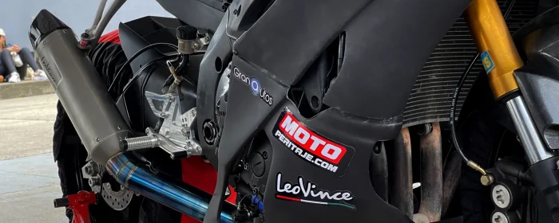

### ¿QUÉ REVISAMOS EN EL PERITAJE DE UNA MOTO?  _(H2)_

Sistemas eléctricos

Las motos modernas al igual que los carros, tienen sistemas eléctricos más profundos con computadores a bordo y conexiones a sistemas de ayudas y tipos de manejo como el ABS, es por eso que se debe tener en cuenta al máximo.

Motor y suspensión

Un motor en perfecto estado debe estar sin fugas de aceite o refrigerantes, sin cambios o daños en su estructura, la suspensión en una moto es de alto interés, en especial las horquillas y sus componentes, ya que son ellas quienes se encargan de dar la fiabilidad en curvas y frenadas.

Documentos

Una documentación al día nos permite tener la tranquilidad de realizar cualquier tipo de trámite ante las autoridades de tránsito, según sea el caso, comparendos, embargos o prendas podrían cambiar radicalmente el curso de una negociación.

Chasis y estructura

El Chasis de una moto se divide en diferentes partes, depende de qué tipo de moto sea, si es Naked, Superbike o Scooter.

Sistemas de identificación

Los sistemas de identificación y su cotejo con nuestras bases de datos nos permiten estar seguros de su originalidad y consistencia.

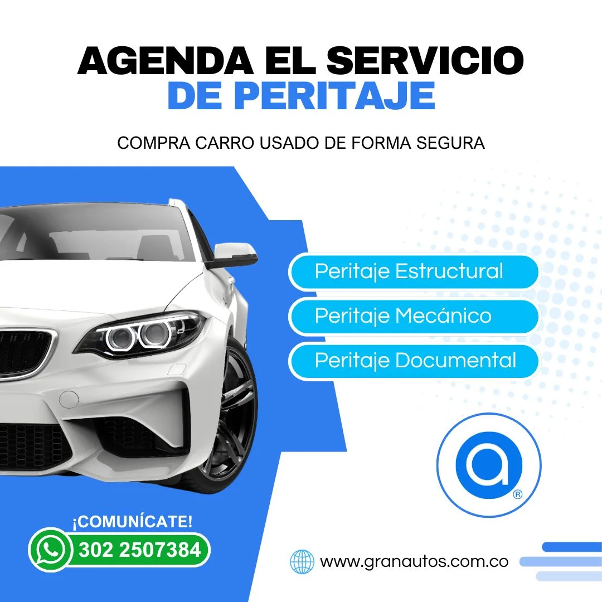 (enlaza a https://granautos.com.co/)


`[sección 64f2167]`

#### LO QUE DICEN NUESTROS CLIENTES  _(H3)_

##### Clientes satisfechos han confiado en nosotros para su peritaje de vehículos.  _(H4)_


`[sección cec9b63]`

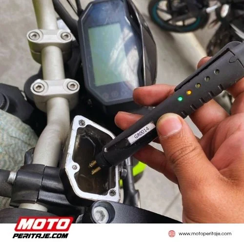

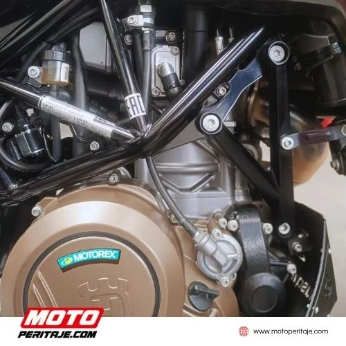

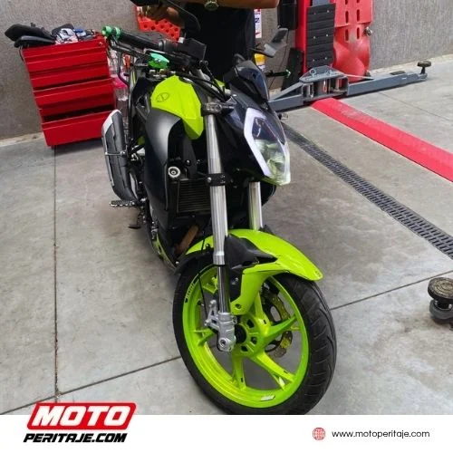

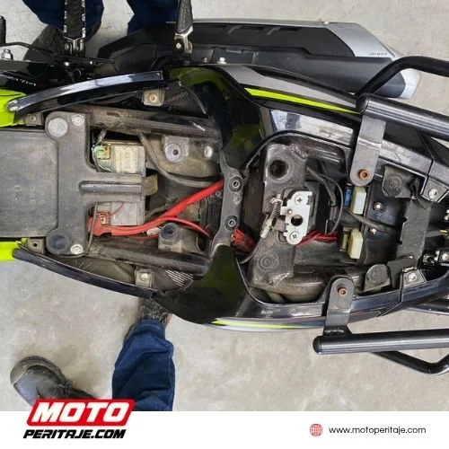

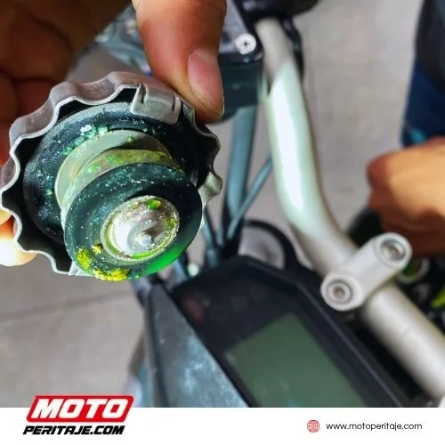

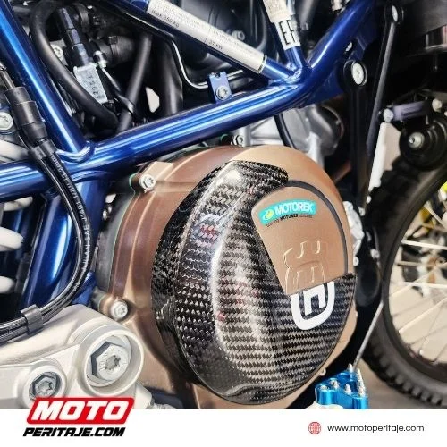

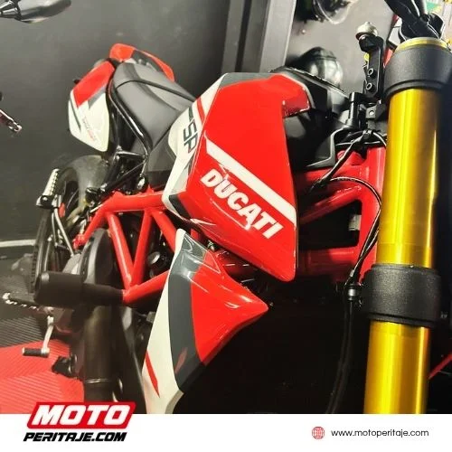

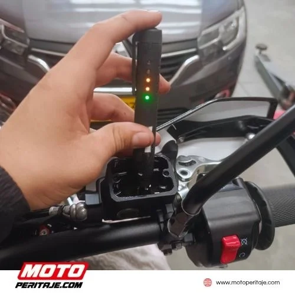

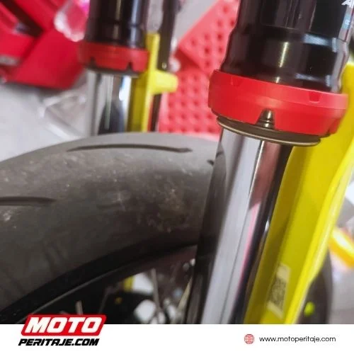


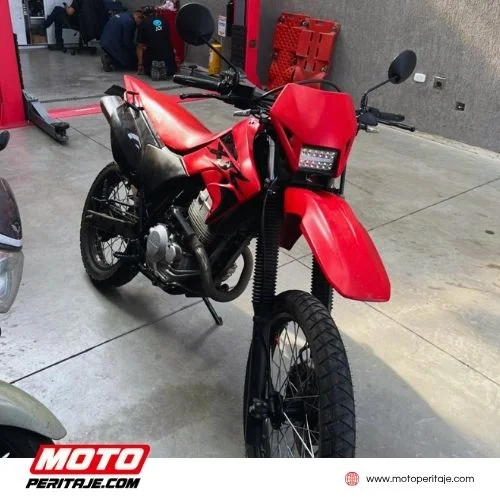


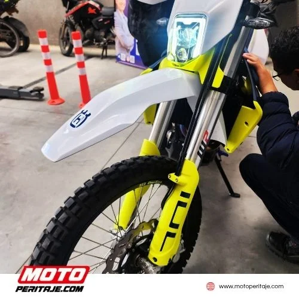


`[sección 786abc1]`

Solicita el peritaje de tu moto

###### ¡Contamos con expertos que te ayudarán!  _(H5)_

### 302 2507384 | 302 1138434 | 301 9262267  _(H2)_


**[BOTÓN] ¡Agenda tu servicio ahora!** → https://wa.me/573022507384


`[sección 99eca8d]`


**[BOTÓN] BLOG INFORMATIVO ¡Descubre más!** → https://motoperitaje.com/blog/

#### SERVICIOS RELACIONADOS  _(H3)_


`[sección 9da27eb]`

Servicio de peritaje de vehículos en bogotá.

www.granautos.com.co/sala


`[sección ee7be54]`

Servicio de peritaje de vehículos a domicilio.

www.granautos.com.co/domicilio


`[sección 99eca8d]`

#### ¿QUÈ ES MOTOPERITAJE.COM?  _(H3)_

Somos una compañía con más de 5 años de experiencia en revisión, alistamiento y peritaje de motos, con técnicos especialistas en sistemas de identificación, procesos de pintura, chasis y carrocería.

#### ¿POR QUÉ CONTRATARNOS?  _(H3)_

Porque somos una de las empresas líderes, contamos con equipos especializados en la revisión de vehículos automotores, motos, carros y semi pesados, sistemas de Scanner y analizador de gases para moto y carro, elevadores, medidores de espesor sobre lámina.


`[sección b80ff4b]`

#### CONOCE NUESTRO  _(H3)_

#### BLOG INFORMATIVO  _(H3)_


`[sección 97da884]`

Bienvenid@ al blog de MOTOPERITAJE tu fuente de información confiable y actualizada sobre evaluación y peritaje de motos.


`[sección af62ea3]`

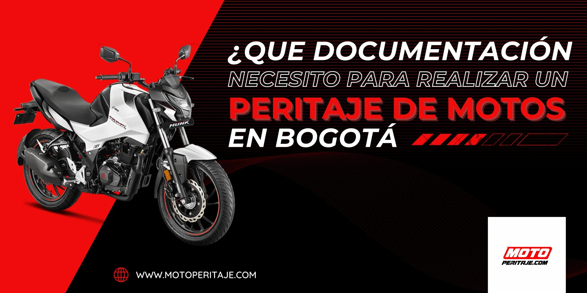 (enlaza a https://moto%20peritaje.com/que-documentacion-necesito-para-realizar-un-peritaje-de-motos-en-bogota/)

 (enlaza a https://motoperitaje.com/como-el-peritaje-revela-su-verdadero-precio-en-el-mercado-de-las-motos/)

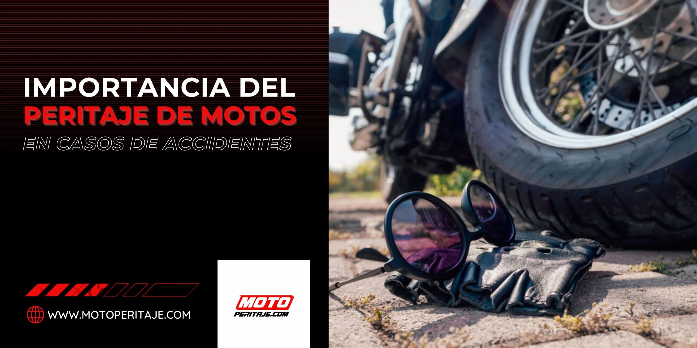 (enlaza a https://motoperitaje.com/importancia-del-peritaje-de-motos-en-casos-de-accidentes/)


`[sección 0b95263]`

#### INSPECCIÓN TÉCNICA DE MOTOCLICLETAS  _(H3)_

#### Especialistas en Inspección y Avalúo Comercial  _(H3)_

Nuestro equipo se dedica exclusivamente a la inspección técnica de peritajes y avalúos comerciales. Somos especialistas formados para identificar cada detalle estructural y funcional de motocicletas.

Entendemos que una moto es una inversión y una pasión. Por eso, nuestro personal aplica un criterio técnico riguroso para determinar el estado real y el valor comercial justo de cada unidad en el mercado actual.


`[sección 694e493]`


`[sección b5d6c74]`

#### NUESTROS ALIADOS  _(H3)_


`[sección afd4317]`


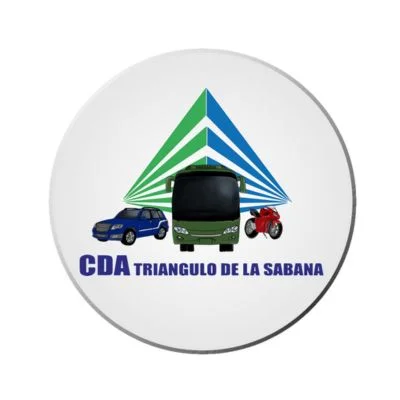

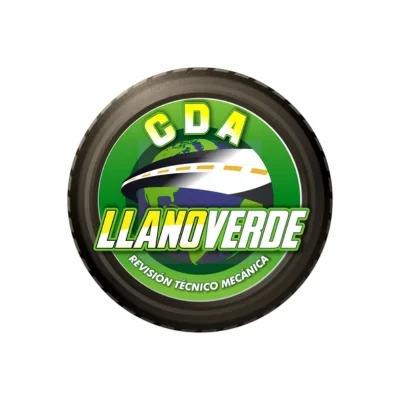

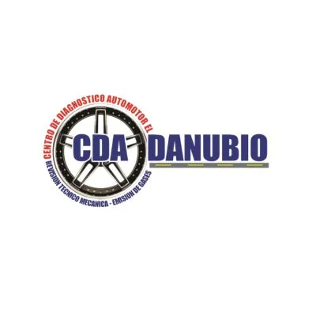


`[sección da63971]`

#### PREGUNTAS FRECUENTES  _(H3)_


`[sección 6b64acb]`

##### SOBRE EL SERVICIO DE PERITAJE  _(H4)_


`[sección a0371a1]`

¿Qué incluye el peritaje de motos en Motoperitaje?

Evaluación estructural, revisión de motor, chasis, suspensión, carenajes, luces, frenos, papeles legales y más.

¿Cuánto dura un peritaje de moto?

El proceso suele durar entre 30 y 45 minutos, dependiendo del tipo de motocicleta.

¿El peritaje incluye revisión legal (comparendos, embargos)?

Sí. Verificamos antecedentes, multas, embargos, siniestros y vigencia de documentos.

¿Puedo asistir con el vendedor de la moto?

Si, recomendamos que el comprador y el vendedor estén presentes para mayor transparencia.

¿Realizan peritajes de motos a domicilio?

si, puedes revisar toda la información de nuestro servicio a domicilio en: PERITAJE DE MOTOS A DOMICILIO ✓

¿Se entregan algún informe al finalizar el servicio?

Se proporciona un informe por correo electrónico o WhatsApp, mientras que nuestro inspector le explica detalladamente el servicio verbalmente una vez finalizado.

¿El informe sirve como soporte para la compra de una moto usada?

Totalmente. Es un respaldo para tomar decisiones informadas y seguras.

¿Qué pasa si la moto no está en buen estado?

Te informaremos con total claridad. Nuestro objetivo es ayudarte a evitar una mala inversión.

¿El peritaje garantiza que no tendré problemas con la moto después?

Ofrecemos una evaluación objetiva, pero recuerda que el mantenimiento futuro depende del uso.

¿El peritaje garantiza que la moto no falle?

No. El peritaje no garantiza que la moto no vaya a fallar. El peritaje evalúa el estado general de la motocicleta en el momento de la inspección, mediante una revisión visual y técnica no invasiva, basada en la experiencia del perito y en las condiciones observables al instante.

¿Qué pasa si no pasa el peritaje vehicular?

Si el vehículo no aprueba el peritaje, significa que se identificaron hallazgos, inconsistencias o riesgos (técnicos, estructurales o documentales) al momento de la inspección. Esto no impide la venta ni circulación, pero sí es una alerta importante para negociar el precio, exigir reparaciones o decidir no comprar. El peritaje es un servicio informativo y comercial, no una sanción ni una garantía.

¿El peritaje es obligatorio?

No, el peritaje no es obligatorio. Es un servicio voluntario, recomendado para conocer el estado técnico, estructural y/o documental del vehículo antes de comprar o vender. Ayuda a tomar decisiones informadas, pero no es un requisito legal.


`[sección 1c63af3]`

##### PRECIOS Y FORMAS DE PAGO  _(H4)_

¿Cuál es el costo del peritaje en el 2026?

El precio varía según el tipo de motocicleta. Puedes solicitar una cotización rápida por WhatsApp.

¿Puedo pagar en efectivo o con tarjeta?

Aceptamos pagos en efectivo, transferencia bancaria y medios digitales como Bre-B, Nequi o Daviplata.

¿Quién debe realizar el pago del peritaje?

El pago del peritaje debe realizarlo la persona que solicita el servicio, es decir, quien agenda la cita con Moto Peritaje.

En la práctica puede ser:

- El comprador, cuando quiere asegurarse de que el vehículo esté en buen estado antes de comprar.
- El vendedor, cuando desea respaldar la venta con un informe técnico confiable.
- Una empresa, aseguradora o entidad financiera, si el peritaje hace parte de un proceso interno.

`[sección 4c929ae]`

##### ATENCIÓN AL CLIENTE  _(H4)_


`[sección a0371a1]`

¿Necesito agendar una cita?

No es necesario. Atendemos sin cita previa, pero puedes contactarnos para asegurar disponibilidad.

¿Dónde están ubicados?

Actualmente, Granautos cuenta con tres sedes en la ciudad de Bogotá.▪️ Sede Principal: Carrera 50 #2-49 B. Jazmín.▪️ Sede Prado Veraniego: Calle 134 # 46-35.

Horarios de Atención

- Lunes a Viernes: 8:00 a.m. a 4:00 p.m.
- Sábados: 8:00 a.m. a 1:00 p.m.

`[sección c9d3c55]`

###### SÍGUENOS EN INSTAGRAM  _(H5)_

###### @motoperitaje  _(H6)_


`[sección 8ae90de]`

 (enlaza a https://www.instagram.com/motoperitaje/)

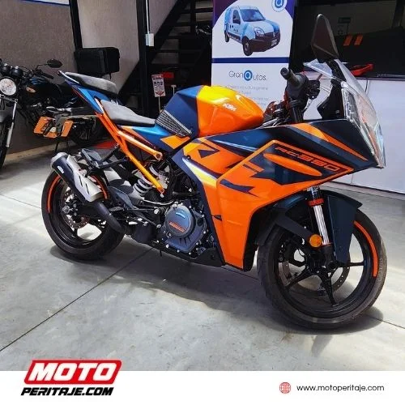 (enlaza a https://www.instagram.com/motoperitaje/)

 (enlaza a https://www.instagram.com/motoperitaje/)

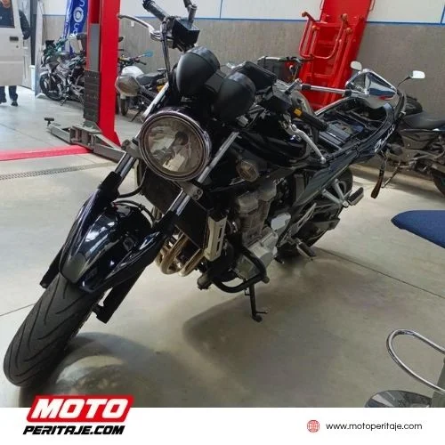 (enlaza a https://www.instagram.com/motoperitaje/)

 (enlaza a https://www.instagram.com/motoperitaje/)

 (enlaza a https://www.instagram.com/motoperitaje/)

 (enlaza a https://www.instagram.com/motoperitaje/)

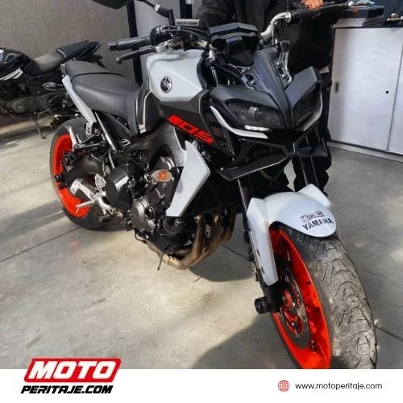 (enlaza a https://www.instagram.com/motoperitaje/)

 (enlaza a https://www.instagram.com/motoperitaje/)

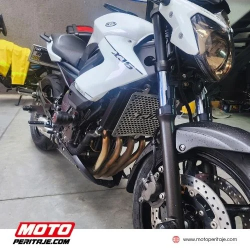 (enlaza a https://www.instagram.com/motoperitaje/)


`[sección d631854]`

Keywords: Peritaje para motos, precio peritaje moto, peritaje de moto precio, peritaje motos bogota, cuanto vale un peritaje de una moto, peritaje de motos bogotá norte, peritaje bogotá norte, peritaje en el norte de bogotá, peritaje motos precios, valor peritaje moto, peritaje motos Bogotá.


`[sección 4c908d7]`


**[BOTÓN] POLÍTICA DE TRATAMIENTO DE DATOS** → https://motoperitaje.com/politica-de-tratamiento-de-datos/


`[sección c09d127]`

### ¡SÍGUENOS EN REDES!  _(H2)_


`[sección 666e8e9]`


**[BOTÓN] Facebook** → https://www.facebook.com/motoperitaje/


**[BOTÓN] Instagram** → https://www.instagram.com/motoperitaje/


**[BOTÓN] Tik Tok** → https://www.tiktok.com/@motoperitaje.com


**[BOTÓN] WhatsApp** → https://wa.me/573022507384


`[sección bd4cc5a]`

### ESTAMOS UBICADOS EN  _(H2)_


**[BOTÓN] Carrera 50 #2-49. B. Jazmín** → (sin enlace)


**[BOTÓN] Calle 134 # 46-35 - Prado Veraniego** → (sin enlace)


`[sección aae628d]`

#### HORARIOS DE ATENCIÓN  _(H3)_

Lunes a Viernes: 8:00 a.m. a 4:00 p.m.Sábados: 8:00 a.m. a 1:00 p.m.


`[sección a4adad5]`


**[IFRAME]** data:image/svg+xml;base64,PHN2ZyB3aWR0aD0iMSIgaGVpZ2h0PSIxIiB4bWxucz0iaHR0cDovL3d3dy53My5vcmcvMjAwMC9zdmciPjwvc3ZnPg==


`[sección 453303a]`


Copyright 2026 © Moto Peritaje | Todos los derechos reservados


## JSON-LD (schema) original

```json
[
  {
    "@context": "https://schema.org",
    "@graph": [
      {
        "@type": "BreadcrumbList",
        "@id": "https://motoperitaje.com/#breadcrumblist",
        "itemListElement": [
          {
            "@type": "ListItem",
            "@id": "https://motoperitaje.com#listItem",
            "position": 1,
            "name": "Home"
          }
        ]
      },
      {
        "@type": "Organization",
        "@id": "https://motoperitaje.com/#organization",
        "name": "Moto Peritaje",
        "description": "Peritaje de motos en Bogotá con expertos certificados. Revisión completa, informe técnico inmediato y sin cita previa. ¡Cotiza tu peritaje hoy en Moto Peritaje! WhatsApp 3022507384",
        "url": "https://motoperitaje.com/",
        "email": "motoperitaje@gmail.com",
        "telephone": "+573022507384",
        "foundingDate": "2023-01-01",
        "logo": {
          "@type": "ImageObject",
          "url": "https://motoperitaje.com/wp-content/uploads/2021/12/27176.png",
          "@id": "https://motoperitaje.com/#organizationLogo",
          "width": 512,
          "height": 512
        },
        "image": {
          "@id": "https://motoperitaje.com/#organizationLogo"
        }
      },
      {
        "@type": "WebPage",
        "@id": "https://motoperitaje.com/#webpage",
        "url": "https://motoperitaje.com/",
        "name": "Peritaje de Motos en Bogotá - Avalúo Profesional y Preciso",
        "description": "Peritaje y avalúo de motos en Bogotá con tecnología avanzada: escáneres, analizador de gases y más. ¡Agenda tu cita ahora! 3022507384",
        "inLanguage": "es-ES",
        "isPartOf": {
          "@id": "https://motoperitaje.com/#website"
        },
        "breadcrumb": {
          "@id": "https://motoperitaje.com/#breadcrumblist"
        },
        "datePublished": "2021-12-06T18:06:36+00:00",
        "dateModified": "2026-05-07T16:39:01+00:00"
      },
      {
        "@type": "WebSite",
        "@id": "https://motoperitaje.com/#website",
        "url": "https://motoperitaje.com/",
        "name": "Peritaje de Motos HOY en Bogotá 🚀 Sin Cita Previa | Motoperitaje",
        "alternateName": "Peritaje de Motos HOY en Bogotá 🚀 Sin Cita Previa | Motoperitaje",
        "description": "Peritajes y revision de motos y super motos",
        "inLanguage": "es-ES",
        "publisher": {
          "@id": "https://motoperitaje.com/#organization"
        }
      }
    ]
  }
]
```
