# /peritaje-de-motos-a-domicilio-en-bogota/

| Campo | Valor |
|---|---|
| URL | https://motoperitaje.com/peritaje-de-motos-a-domicilio-en-bogota/ |
| <title> | Peritaje de Motos a Domicilio en Bogotá | Compra Segura |
| meta description | Peritaje de moto a domicilio en Bogotá. Revisamos la moto antes de comprarla y te entregamos informe técnico completo. Agenda hoy mismo 301 9262267. |
| robots | max-image-preview:large |
| canonical | https://motoperitaje.com/peritaje-de-motos-a-domicilio-en-bogota/ |
| og:locale | es_ES |
| og:site_name | Peritaje de Motos HOY en Bogotá, Sin Cita Previa | Motoperitaje | Peritajes y revision de motos y super motos |
| og:type | article |
| og:title | Peritaje de Motos a Domicilio en Bogotá | Compra Segura |
| og:description | Peritaje de moto a domicilio en Bogotá. Revisamos la moto antes de comprarla y te entregamos informe técnico completo. Agenda hoy mismo 301 9262267. |
| og:url | https://motoperitaje.com/peritaje-de-motos-a-domicilio-en-bogota/ |
| og:image | https://motoperitaje.com/wp-content/uploads/2026/01/cropped-moto-peritaje-marca.webp |
| og:image:secure_url | https://motoperitaje.com/wp-content/uploads/2026/01/cropped-moto-peritaje-marca.webp |
| article:published_time | 2026-02-19T15:19:45+00:00 |
| article:modified_time | 2026-05-07T15:50:44+00:00 |
| twitter:card | summary |
| twitter:title | Peritaje de Motos a Domicilio en Bogotá | Compra Segura |
| twitter:description | Peritaje de moto a domicilio en Bogotá. Revisamos la moto antes de comprarla y te entregamos informe técnico completo. Agenda hoy mismo 301 9262267. |
| twitter:image | https://motoperitaje.com/wp-content/uploads/2026/01/cropped-moto-peritaje-marca.webp |

WhatsApp: https://wa.me/573022507384  
Teléfonos: 3022507384  
YouTube: —

## Contenido en orden de aparición

> `[sección <id>]` = id del contenedor Elementor (sirve para buscar su estilo en css-original/post-*.css con el selector .elementor-element-<id>).


`[sección e3864ce]`

## ¿VAS A COMPRAR UNA MOTO USADA? HAZ UN PERITAJE PROFESIONAL A DOMICILIO ANTES DE PAGAR.  _(H1)_


`[sección 2cafd33]`

- Inicio
- Precio Peritaje Motos
- Precios a Domicilio
- Peritaje Carros
- Contáctanos
- Blog
- Inicio
- Precio Peritaje Motos
- Precios a Domicilio
- Peritaje Carros
- Contáctanos
- Blog

`[sección d917cdc]`


**[BOTÓN] SOMOS TU ALIADO** → #

### PERITAJE DE MOTOS A DOMICILIO EN BOGOTÁ  _(H2)_

Compra tu moto usada con total seguridad sin salir de casa

Si vas a comprar una moto usada en Bogotá, nuestro servicio de peritaje a domicilio revisa la moto donde se encuentre: casa del vendedor, concesionario o parqueadero.

Te entregamos un informe técnico completo para que tomes una decisión segura y evites fraudes o daños ocultos.

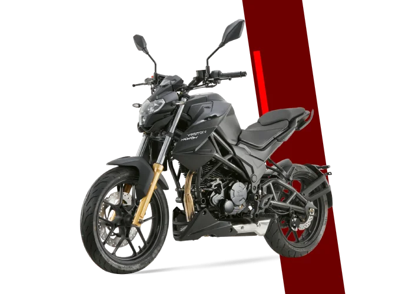


`[sección bb99033]`

#### ¿QUÉ ES UN PERITAJE DE MOTO A DOMICILIO?  _(H3)_

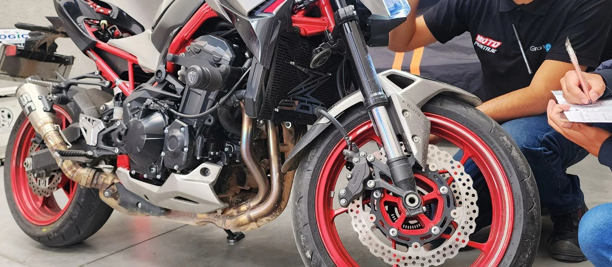

Es una inspección técnica profesional que realizamos directamente en el lugar donde está la moto.

Revisamos:


`[sección f7b70e4]`

- Estado estructural
- Motor
- Sistema eléctrico
- Frenos
- Suspensión
- Chasis
- Señales de accidente
- Fugas y reparaciones ocultas
- Documentación básica

`[sección 7a4ec86]`


**[BOTÓN] CATEGORÍA URBAN (O - 149 cc)** → (sin enlace)


**[BOTÓN] CATEGORÍA STREET (150 - 290 cc)** → (sin enlace)


`[sección 903670e]`

#### PERITAJE ESENCIAL  _(H3)_

$ 167 000 SERVICIO A DOMICILIO

- Revisión estructural
- Revisión de carenajes y pintura
- Verificación de comparendos y multas
- Informe detallado del estado real de la moto
- Revisión de embargos y siniestros
- Tiempo del servicio: 40 a 60 minutos
- Inspección de suspensión
- Revisión de motor
- Prueba de compresión (nivel 1)
- Revisión de frenos
- Verificación de cadena, rines y llantas
- Revisión de sistemas de identificación
- Histórico de propietarios
- Verificación de pendientes del propietario

**[BOTÓN] Agendar Inspección ⬆︎** → https://wa.me/573022507384

#### PERITAJE AVANZADO  _(H3)_

$ 254 000 SERVICIO A DOMICILIO

- Revisión estructural
- Revisión de carenajes y pintura
- Verificación de comparendos y multas
- Revisión de embargos y siniestros
- Inspección de suspensión
- Revisión de motor
- Prueba de compresión (nivel 1)
- Revisión de frenos
- Verificación de cadena, rines y llantas
- Revisión de sistemas de identificación
- Histórico de propietarios
- Verificación de pendientes del propietario
- Informe detallado del estado real de la moto
- Tiempo del servicio: 40 a 60 minutos

**[BOTÓN] Agendar Inspección ⬆︎** → https://wa.me/573022507384

#### PERITAJE ESENCIAL  _(H3)_

$ 203 000 SERVICIO A DOMICILIO

- Revisión estructural
- Revisión de carenajes y pintura
- Verificación de comparendos y multas
- Informe detallado del estado real de la moto
- Revisión de embargos y siniestros
- Tiempo del servicio: 40 a 60 minutos
- Inspección de suspensión
- Revisión de motor
- Prueba de compresión (nivel 1)
- Revisión de frenos
- Verificación de cadena, rines y llantas
- Revisión de sistemas de identificación
- Histórico de propietarios
- Verificación de pendientes del propietario

**[BOTÓN] Agendar Inspección ⬆︎** → https://wa.me/573022507384

#### PERITAJE AVANZADO  _(H3)_

$ 292 000 SERVICIO A DOMICILIO

- Revisión estructural
- Revisión de carenajes y pintura
- Verificación de comparendos y multas
- Revisión de embargos y siniestros
- Inspección de suspensión
- Revisión de motor
- Prueba de compresión (nivel 1)
- Revisión de frenos
- Verificación de cadena, rines y llantas
- Revisión de sistemas de identificación
- Histórico de propietarios
- Verificación de pendientes del propietario
- Informe detallado del estado real de la moto
- Tiempo del servicio: 40 a 60 minutos

**[BOTÓN] Agendar Inspección ⬆︎** → https://wa.me/573022507384


`[sección dd2d27d]`


**[BOTÓN] CATEGORÍA SPORT (291 - 499 cc)** → (sin enlace)


**[BOTÓN] CATEGORÍA PRO (500 - 988 cc)** → (sin enlace)


`[sección 1684bb8]`

#### PERITAJE ESENCIAL  _(H3)_

$ 239 000 SERVICIO A DOMICILIO

- Revisión estructural
- Revisión de carenajes y pintura
- Verificación de comparendos y multas
- Informe detallado del estado real de la moto
- Revisión de embargos y siniestros
- Tiempo del servicio: 40 a 60 minutos
- Inspección de suspensión
- Revisión de motor
- Prueba de compresión (nivel 1)
- Revisión de frenos
- Verificación de cadena, rines y llantas
- Revisión de sistemas de identificación
- Histórico de propietarios
- Verificación de pendientes del propietario

**[BOTÓN] Agendar Inspección ⬆︎** → https://wa.me/573022507384

#### PERITAJE AVANZADO  _(H3)_

$ 339 000 SERVICIO A DOMICILIO

- Revisión estructural
- Revisión de carenajes y pintura
- Verificación de comparendos y multas
- Revisión de embargos y siniestros
- Inspección de suspensión
- Revisión de motor
- Sistema de escape
- Revisión de frenos
- Verificación de cadena, rines y llantas
- Revisión de sistemas de identificación
- Histórico de propietarios
- Verificación de pendientes del propietario
- Informe detallado del estado real de la moto
- Tiempo del servicio: 40 a 60 minutos

**[BOTÓN] Agendar Inspección ⬆︎** → https://wa.me/573022507384

#### PERITAJE ESENCIAL  _(H3)_

$ 295 000 SERVICIO A DOMICILIO

- Revisión estructural
- Revisión de carenajes y pintura
- Verificación de comparendos y multas
- Informe detallado del estado real de la moto
- Revisión de embargos y siniestros
- Tiempo del servicio: 40 a 60 minutos
- Inspección de suspensión
- Revisión de motor
- Prueba de compresión (nivel 1)
- Revisión de frenos
- Verificación de cadena, rines y llantas
- Revisión de sistemas de identificación
- Histórico de propietarios
- Verificación de pendientes del propietario

**[BOTÓN] Agendar Inspección ⬆︎** → https://wa.me/573022507384

#### PERITAJE AVANZADO  _(H3)_

$ 390 000 SERVICIO A DOMICILIO

- Revisión estructural
- Revisión de carenajes y pintura
- Verificación de comparendos y multas
- Revisión de embargos y siniestros
- Inspección de suspensión
- Revisión de motor
- Sistema de escape
- Revisión de frenos
- Verificación de cadena, rines y llantas
- Revisión de sistemas de identificación
- Histórico de propietarios
- Verificación de pendientes del propietario
- Informe detallado del estado real de la moto
- Tiempo del servicio: 40 a 60 minutos

**[BOTÓN] Agendar Inspección ⬆︎** → https://wa.me/573022507384


`[sección 9a6a673]`

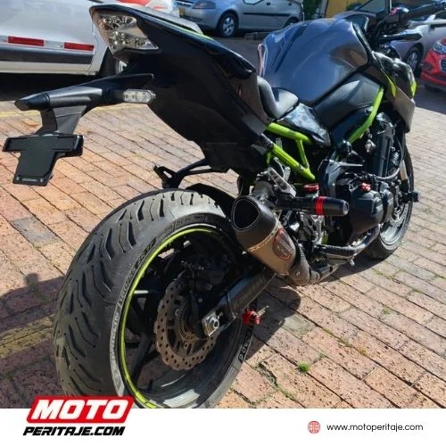

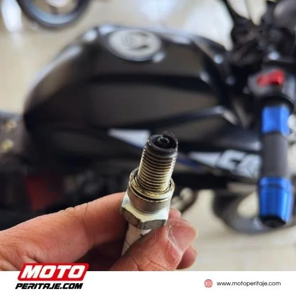

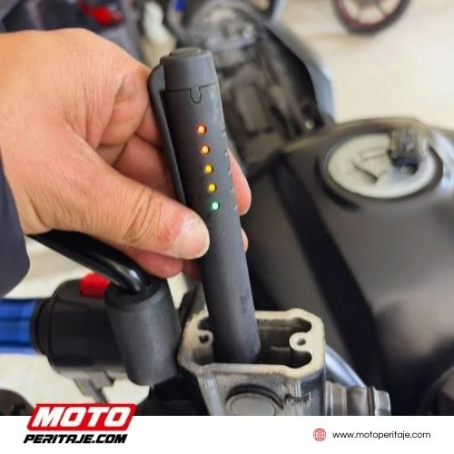

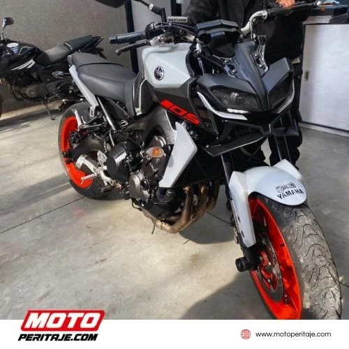

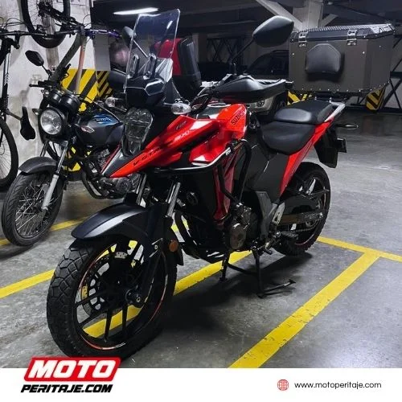

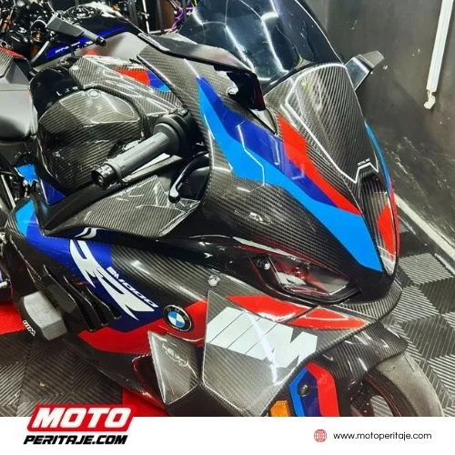

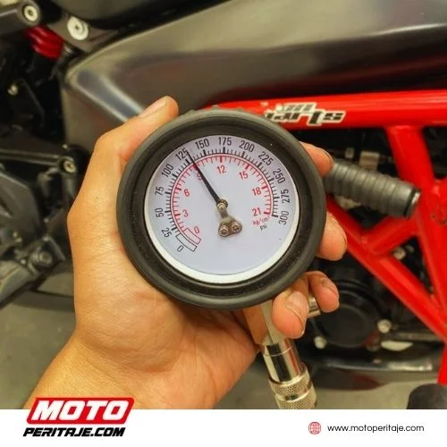

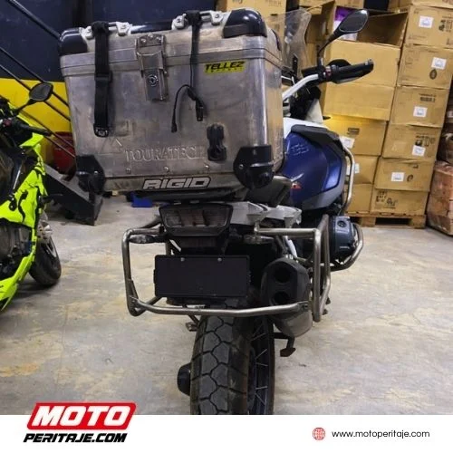

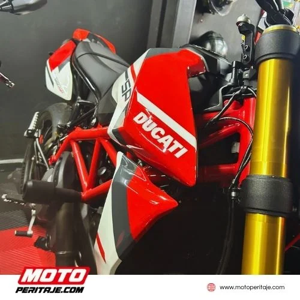

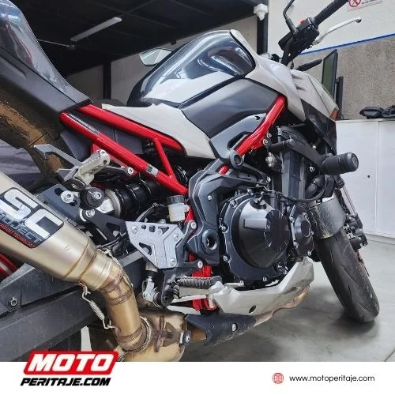


`[sección 4589132]`

Solicita el peritaje de tu moto a domicilio hoy mismo

##### ¡Contamos con expertos que te ayudarán!  _(H4)_

### 302 1138434 | 302 2507384 | 301 9262267  _(H2)_


**[BOTÓN] Cotizar Peritaje de Moto a Domicilio** → https://wa.me/573022507384


`[sección 0f23c73]`

#### PREGUNTAS FRECUENTES  _(H3)_


`[sección e067bd0]`

##### SOBRE EL SERVICIO DE PERITAJE  _(H4)_


`[sección b691efa]`

¿Qué incluye el peritaje de motos a domicilio en Motoperitaje?

Evaluación estructural, revisión de motor, chasis, suspensión, carenajes, luces, frenos, papeles legales y más.

¿Cuánto dura el peritaje de moto a domicilio?

El servicio tarda entre 45 a 1 Hora y 30 minutos, dependiendo del tipo de moto y el nivel de inspección solicitado.

¿El peritaje incluye prueba de manejo?

Si las condiciones lo permiten y el propietario lo autoriza, se realiza una verificación funcional básica. Sin embargo, el enfoque principal es técnico y estructural.

¿Pueden hacer el peritaje en un concesionario o parqueadero?

Sí. Realizamos el servicio donde esté ubicada la moto, siempre que se pueda acceder a ella para hacer la revisión completa.

¿Sirve el peritaje para cualquier marca de moto?

Sí. Revisamos motos de todas las marcas y cilindrajes: Yamaha, Honda, Suzuki, Bajaj, KTM, AKT, Hero, TVS, entre otras.

¿Cuánto cuesta un peritaje de moto a domicilio?

El valor depende de la ubicación, el tipo de moto y el nivel de inspección. Puedes verificar la información de nuestros planes o comunicarte directamente con nuestra área comercial por WhatsApp (+57) 302 1138434 | (+57) 302 2507384.

¿En qué zonas realizan el peritaje a domicilio?

Prestamos el servicio en Bogotá y alrededores. Puedes consultarnos disponibilidad por WhatsApp (+57) 302 1138434 | (+57) 302 2507384 para tu ubicación específica.

¿El peritaje garantiza que la moto no fallará en el futuro?

No. El peritaje evalúa el estado actual de la moto al momento de la inspección. No es una garantía mecánica, pero reduce significativamente el riesgo de una mala compra.


`[sección fcb10f3]`

##### PRECIOS Y FORMAS DE PAGO  _(H4)_

¿Cuál es el costo del peritaje en el 2026?

El precio varía según el tipo de motocicleta. Puedes solicitar una cotización rápida por WhatsApp.

¿Puedo pagar en efectivo o con tarjeta?

Aceptamos pagos en efectivo, transferencia bancaria y medios digitales como Bre-B, Nequi o Daviplata.

¿Quién debe realizar el pago del peritaje?

El pago del peritaje debe realizarlo la persona que solicita el servicio, es decir, quien agenda la cita con Moto Peritaje.

En la práctica puede ser:

- El comprador, cuando quiere asegurarse de que el vehículo esté en buen estado antes de comprar.
- El vendedor, cuando desea respaldar la venta con un informe técnico confiable.
- Una empresa, aseguradora o entidad financiera, si el peritaje hace parte de un proceso interno.

`[sección 1561892]`

##### ATENCIÓN AL CLIENTE  _(H4)_


`[sección b691efa]`

¿Necesito agendar una cita?

No es necesario. Atendemos sin cita previa, pero puedes contactarnos para asegurar disponibilidad.

¿Dónde están ubicados?

Actualmente, Granautos cuenta con tres sedes en la ciudad de Bogotá.▪️ Sede Principal: Carrera 50 #2-49 B. Jazmín.▪️ Sede Prado Veraniego: Calle 134 # 46-35.

Horarios de Atención

- Lunes a Viernes:
Programa tu domicilio en los siguientes horarios: 9:00 a.m. | 11:00 a.m. | 2:00 p.m.


`[sección 8d35cf5]`

#### HORARIOS DE ATENCIÓN  _(H3)_

Programa tu domicilio en los siguientes horarios: 9:00 a.m. | 11:00 a.m. | 2:00 p.m.


`[sección 8d140de]`

##### ESTAMOS UBICADOS EN  _(H4)_


**[BOTÓN] Carrera 50 #2-49. B. Jazmín** → (sin enlace)


**[BOTÓN] Calle 134 # 46-35 - Prado Veraniego** → (sin enlace)


`[sección a59c0d0]`


**[IFRAME]** data:image/svg+xml;base64,PHN2ZyB3aWR0aD0iMSIgaGVpZ2h0PSIxIiB4bWxucz0iaHR0cDovL3d3dy53My5vcmcvMjAwMC9zdmciPjwvc3ZnPg==


`[sección 4d45a5f]`


Copyright 2026 © Moto Peritaje | Todos los derechos reservados


## JSON-LD (schema) original

```json
[
  {
    "@context": "https://schema.org",
    "@graph": [
      {
        "@type": "BreadcrumbList",
        "@id": "https://motoperitaje.com/peritaje-de-motos-a-domicilio-en-bogota/#breadcrumblist",
        "itemListElement": [
          {
            "@type": "ListItem",
            "@id": "https://motoperitaje.com#listItem",
            "position": 1,
            "name": "Home",
            "item": "https://motoperitaje.com",
            "nextItem": {
              "@type": "ListItem",
              "@id": "https://motoperitaje.com/peritaje-de-motos-a-domicilio-en-bogota/#listItem",
              "name": "Peritaje de Motos a Domicilio en Bogotá | Compra Segura"
            }
          },
          {
            "@type": "ListItem",
            "@id": "https://motoperitaje.com/peritaje-de-motos-a-domicilio-en-bogota/#listItem",
            "position": 2,
            "name": "Peritaje de Motos a Domicilio en Bogotá | Compra Segura",
            "previousItem": {
              "@type": "ListItem",
              "@id": "https://motoperitaje.com#listItem",
              "name": "Home"
            }
          }
        ]
      },
      {
        "@type": "Organization",
        "@id": "https://motoperitaje.com/#organization",
        "name": "Moto Peritaje",
        "description": "Peritaje de motos en Bogotá con expertos certificados. Revisión completa, informe técnico inmediato y sin cita previa. ¡Cotiza tu peritaje hoy en Moto Peritaje! WhatsApp 3022507384",
        "url": "https://motoperitaje.com/",
        "email": "motoperitaje@gmail.com",
        "telephone": "+573022507384",
        "foundingDate": "2023-01-01",
        "logo": {
          "@type": "ImageObject",
          "url": "https://motoperitaje.com/wp-content/uploads/2021/12/27176.png",
          "@id": "https://motoperitaje.com/peritaje-de-motos-a-domicilio-en-bogota/#organizationLogo",
          "width": 512,
          "height": 512
        },
        "image": {
          "@id": "https://motoperitaje.com/peritaje-de-motos-a-domicilio-en-bogota/#organizationLogo"
        }
      },
      {
        "@type": "WebPage",
        "@id": "https://motoperitaje.com/peritaje-de-motos-a-domicilio-en-bogota/#webpage",
        "url": "https://motoperitaje.com/peritaje-de-motos-a-domicilio-en-bogota/",
        "name": "Peritaje de Motos a Domicilio en Bogotá | Compra Segura",
        "description": "Peritaje de moto a domicilio en Bogotá. Revisamos la moto antes de comprarla y te entregamos informe técnico completo. Agenda hoy mismo 301 9262267.",
        "inLanguage": "es-ES",
        "isPartOf": {
          "@id": "https://motoperitaje.com/#website"
        },
        "breadcrumb": {
          "@id": "https://motoperitaje.com/peritaje-de-motos-a-domicilio-en-bogota/#breadcrumblist"
        },
        "datePublished": "2026-02-19T15:19:45+00:00",
        "dateModified": "2026-05-07T15:50:44+00:00"
      },
      {
        "@type": "WebSite",
        "@id": "https://motoperitaje.com/#website",
        "url": "https://motoperitaje.com/",
        "name": "Peritaje de Motos HOY en Bogotá 🚀 Sin Cita Previa | Motoperitaje",
        "alternateName": "Peritaje de Motos HOY en Bogotá 🚀 Sin Cita Previa | Motoperitaje",
        "description": "Peritajes y revision de motos y super motos",
        "inLanguage": "es-ES",
        "publisher": {
          "@id": "https://motoperitaje.com/#organization"
        }
      }
    ]
  }
]
```
