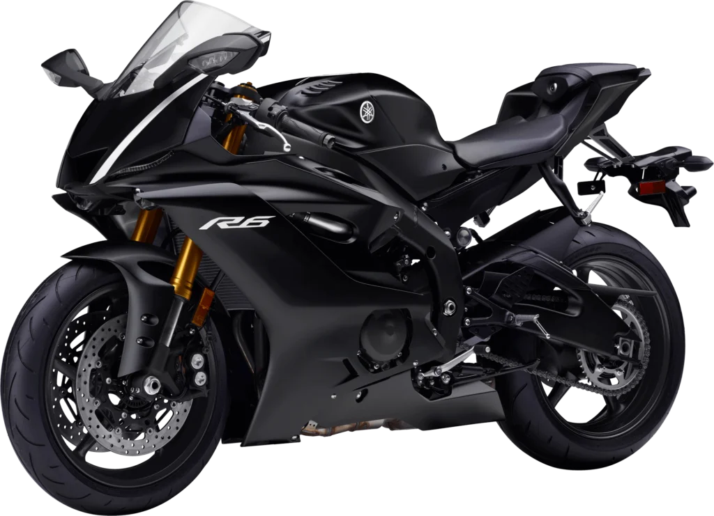
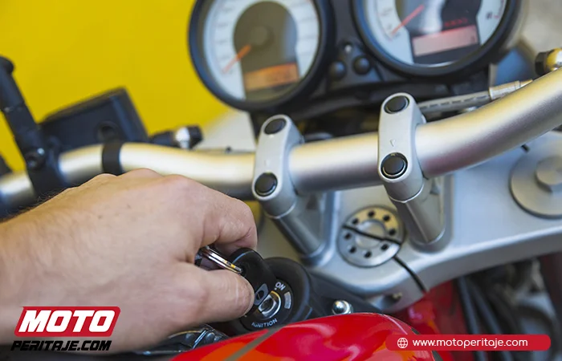
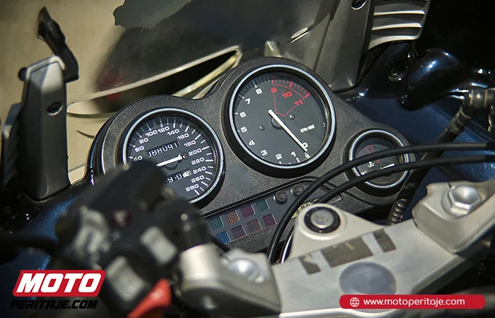
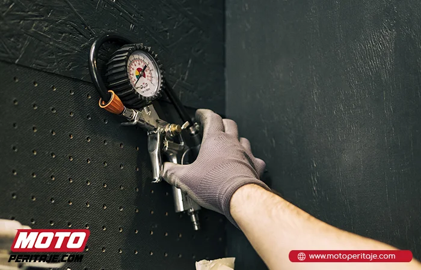
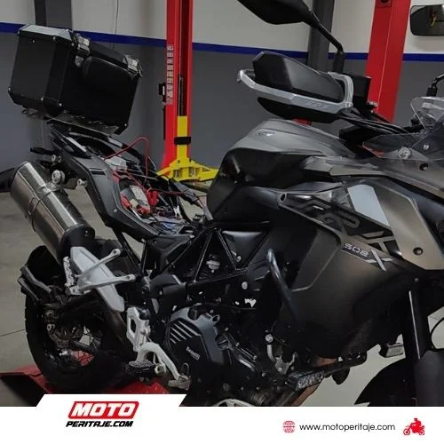
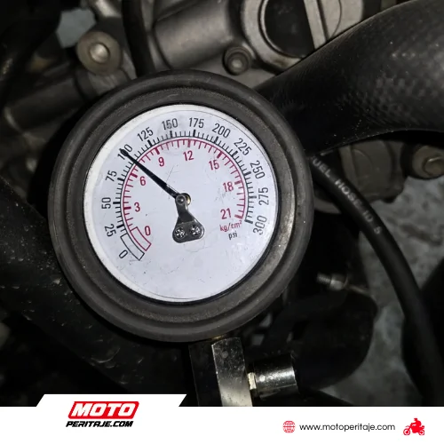
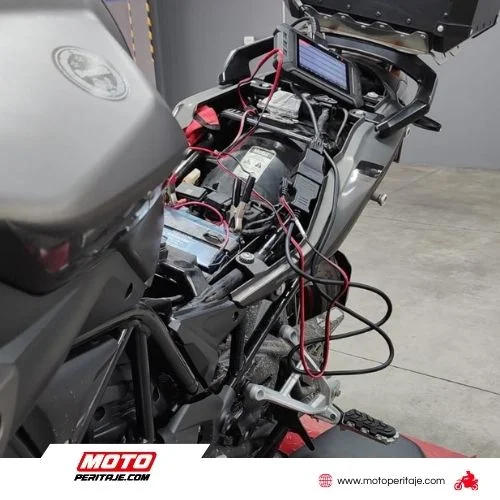
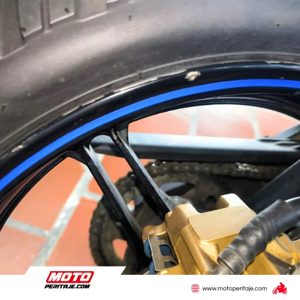
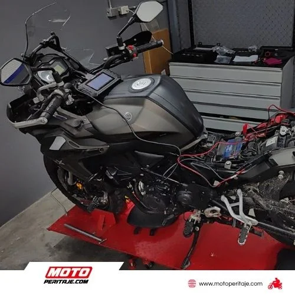
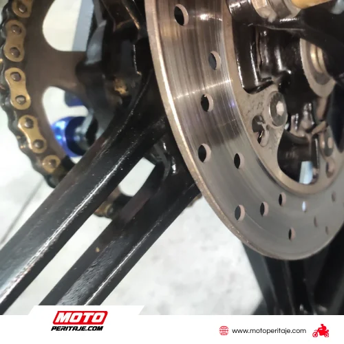

# /precio-peritaje-moto/

| Campo | Valor |
|---|---|
| URL | https://motoperitaje.com/precio-peritaje-moto/ |
| <title> | Peritaje de Motos en Bogotá | Precios, Avalúo y Servicio Profesional |
| meta description | Realiza tu peritaje de moto en Bogotá con expertos. Inspección precisa, avalúo confiable y asesoría profesional. ¡Agenda por WhatsApp 3022507384! |
| robots | max-image-preview:large |
| canonical | https://motoperitaje.com/precio-peritaje-moto/ |
| og:locale | es_ES |
| og:site_name | Peritaje de Motos HOY en Bogotá, Sin Cita Previa | Motoperitaje | Peritajes y revision de motos y super motos |
| og:type | article |
| og:title | Peritaje de Motos en Bogotá | Precios, Avalúo y Servicio Profesional |
| og:description | Realiza tu peritaje de moto en Bogotá con expertos. Inspección precisa, avalúo confiable y asesoría profesional. ¡Agenda por WhatsApp 3022507384! |
| og:url | https://motoperitaje.com/precio-peritaje-moto/ |
| og:image | https://motoperitaje.com/wp-content/uploads/2026/01/cropped-moto-peritaje-marca.webp |
| og:image:secure_url | https://motoperitaje.com/wp-content/uploads/2026/01/cropped-moto-peritaje-marca.webp |
| article:published_time | 2021-12-24T17:49:07+00:00 |
| article:modified_time | 2026-05-07T15:32:25+00:00 |
| twitter:card | summary |
| twitter:title | Peritaje de Motos en Bogotá | Precios, Avalúo y Servicio Profesional |
| twitter:description | Realiza tu peritaje de moto en Bogotá con expertos. Inspección precisa, avalúo confiable y asesoría profesional. ¡Agenda por WhatsApp 3022507384! |
| twitter:image | https://motoperitaje.com/wp-content/uploads/2026/01/cropped-moto-peritaje-marca.webp |

WhatsApp: https://wa.me/573022507384  
Teléfonos: 3022507384  
YouTube: —

## Contenido en orden de aparición

> `[sección <id>]` = id del contenedor Elementor (sirve para buscar su estilo en css-original/post-*.css con el selector .elementor-element-<id>).


`[sección e6794f1]`

## ¿NECESITAS UN PERITAJE PROFESIONAL DE MOTOS EN BOGOTÁ ANTES DE COMPRAR UNA USADA?  _(H1)_


`[sección c27a722]`

- Inicio
- Precio Peritaje Motos
- Precios a Domicilio
- Peritaje Carros
- Contáctanos
- Blog
- Inicio
- Precio Peritaje Motos
- Precios a Domicilio
- Peritaje Carros
- Contáctanos
- Blog

`[sección 917e01c]`


**[BOTÓN] SOMOS TU ALIADO** → #

### PERITAJES PROFESIONALES.​  _(H2)_

Si vas a comprar una moto usada en Bogotá: Un peritaje te permite conocer el estado mecánico real, detectar golpes ocultos, fallas estructurales, alteraciones de chasis o motor, y confirmar que la moto no tenga problemas legales antes de entregar tu dinero.




`[sección 25254a4]`


**[BOTÓN] CATEGORÍA URBAN (O - 149 cc)** → (sin enlace)


**[BOTÓN] CATEGORÍA STREET (150 - 290 cc)** → (sin enlace)


`[sección cfeea31]`

#### PERITAJE ESENCIAL  _(H3)_

$ 127 000 SERVICIO EN SALA

- Revisión estructural
- Revisión de carenajes y pintura
- Verificación de comparendos y multas
- Informe detallado del estado real de la moto
- Revisión de embargos y siniestros
- Tiempo del servicio: 40 a 60 minutos
- Inspección de suspensión
- Revisión de motor
- Prueba de compresión (nivel 1)
- Revisión de frenos
- Verificación de cadena, rines y llantas
- Revisión de sistemas de identificación
- Histórico de propietarios
- Verificación de pendientes del propietario

**[BOTÓN] Agendar Inspección ⬆︎** → https://wa.me/573022507384

#### PERITAJE AVANZADO  _(H3)_

$ 214 000 SERVICIO EN SALA

- Revisión estructural
- Revisión de carenajes y pintura
- Verificación de comparendos y multas
- Revisión de embargos y siniestros
- Inspección de suspensión
- Revisión de motor
- Prueba de compresión (nivel 1)
- Revisión de frenos
- Verificación de cadena, rines y llantas
- Revisión de sistemas de identificación
- Histórico de propietarios
- Verificación de pendientes del propietario
- Informe detallado del estado real de la moto
- Tiempo del servicio: 40 a 60 minutos

**[BOTÓN] Agendar Inspección ⬆︎** → https://wa.me/573022507384

#### PERITAJE ESENCIAL  _(H3)_

$ 163 000 SERVICIO EN SALA

- Revisión estructural
- Revisión de carenajes y pintura
- Verificación de comparendos y multas
- Informe detallado del estado real de la moto
- Revisión de embargos y siniestros
- Tiempo del servicio: 40 a 60 minutos
- Inspección de suspensión
- Revisión de motor
- Prueba de compresión (nivel 1)
- Revisión de frenos
- Verificación de cadena, rines y llantas
- Revisión de sistemas de identificación
- Histórico de propietarios
- Verificación de pendientes del propietario

**[BOTÓN] Agendar Inspección ⬆︎** → https://wa.me/573022507384

#### PERITAJE AVANZADO  _(H3)_

$ 252 000 SERVICIO EN SALA

- Revisión estructural
- Revisión de carenajes y pintura
- Verificación de comparendos y multas
- Revisión de embargos y siniestros
- Inspección de suspensión
- Revisión de motor
- Prueba de compresión (nivel 1)
- Revisión de frenos
- Verificación de cadena, rines y llantas
- Revisión de sistemas de identificación
- Histórico de propietarios
- Verificación de pendientes del propietario
- Informe detallado del estado real de la moto
- Tiempo del servicio: 40 a 60 minutos

**[BOTÓN] Agendar Inspección ⬆︎** → https://wa.me/573022507384


`[sección a3b8e6d]`


**[BOTÓN] CATEGORÍA SPORT (291 - 499 cc)** → (sin enlace)


**[BOTÓN] CATEGORÍA PRO (500 - 988 cc)** → (sin enlace)


`[sección f188009]`

#### PERITAJE ESENCIAL  _(H3)_

$ 199 000 SERVICIO EN SALA

- Revisión estructural
- Revisión de carenajes y pintura
- Verificación de comparendos y multas
- Informe detallado del estado real de la moto
- Revisión de embargos y siniestros
- Tiempo del servicio: 40 a 60 minutos
- Inspección de suspensión
- Revisión de motor
- Prueba de compresión (nivel 1)
- Revisión de frenos
- Verificación de cadena, rines y llantas
- Revisión de sistemas de identificación
- Histórico de propietarios
- Verificación de pendientes del propietario

**[BOTÓN] Agendar Inspección ⬆︎** → https://wa.me/573022507384

#### PERITAJE AVANZADO  _(H3)_

$ 299 000 SERVICIO EN SALA

- Revisión estructural
- Revisión de carenajes y pintura
- Verificación de comparendos y multas
- Revisión de embargos y siniestros
- Inspección de suspensión
- Revisión de motor
- Sistema de escape
- Revisión de frenos
- Verificación de cadena, rines y llantas
- Revisión de sistemas de identificación
- Histórico de propietarios
- Verificación de pendientes del propietario
- Informe detallado del estado real de la moto
- Tiempo del servicio: 40 a 60 minutos

**[BOTÓN] Agendar Inspección ⬆︎** → https://wa.me/573022507384

#### PERITAJE ESENCIAL  _(H3)_

$ 255 000 SERVICIO EN SALA

- Revisión estructural
- Revisión de carenajes y pintura
- Verificación de comparendos y multas
- Informe detallado del estado real de la moto
- Revisión de embargos y siniestros
- Tiempo del servicio: 40 a 60 minutos
- Inspección de suspensión
- Revisión de motor
- Prueba de compresión (nivel 1)
- Revisión de frenos
- Verificación de cadena, rines y llantas
- Revisión de sistemas de identificación
- Histórico de propietarios
- Verificación de pendientes del propietario

**[BOTÓN] Agendar Inspección ⬆︎** → https://wa.me/573022507384

#### PERITAJE AVANZADO  _(H3)_

$ 350 000 SERVICIO EN SALA

- Revisión estructural
- Revisión de carenajes y pintura
- Verificación de comparendos y multas
- Revisión de embargos y siniestros
- Inspección de suspensión
- Revisión de motor
- Sistema de escape
- Revisión de frenos
- Verificación de cadena, rines y llantas
- Revisión de sistemas de identificación
- Histórico de propietarios
- Verificación de pendientes del propietario
- Informe detallado del estado real de la moto
- Tiempo del servicio: 40 a 60 minutos

**[BOTÓN] Agendar Inspección ⬆︎** → https://wa.me/573022507384


`[sección d1cf31c]`

Solicita el peritaje de tu moto

##### ¡Contamos con expertos que te ayudarán!  _(H4)_

### 302 1138434 | 302 2507384 | 301 9262267  _(H2)_


**[BOTÓN] ¡Agenda tu servicio ahora!** → https://wa.me/573022507384


`[sección 60e9918]`


#### ¿QUE INCLUYE?  _(H3)_

- Revisión de documentos
- Scanner para motos
- Compresión nivel 1
- Prueba de gases
- Sistemas de identificación
- Estudio técnico
- Chasis y estructuras
- Prueba de motor
- Antecedentes de siniestros
- Embargos y comparendos


`[sección 9a834f6]`


**[BOTÓN] Comunícate con nuestro soporte en vivo** → https://wa.me/573022507384


`[sección c5191e9]`








`[sección cc297e5]`

#### ¿CÓMO EVALUAMOS LA COMPRESIÓN DEL MOTOR DE TU MOTO?  _(H3)_

Realizamos pruebas de compresión en niveles 1, 2 y 3 para conocer la salud del motor y evitar reparaciones costosas.


`[sección b10c0cb]`

#### COMPRESIÓN NIVEL 1  _(H3)_

SERVICIO EN SALA

- Desarme básico.
- Retiro de piezas que obstruyan para acceso a bujías o partes eléctricas. (Acceso fácil)
- Toma de compresión relativa.
- Tiempo de servicio: 1 Hora y Media.

**[BOTÓN] Agendar Compresión nivel 1 ⬆︎** → https://wa.me/573022507384

#### COMPRESIÓN NIVEL 2  _(H3)_

$ 85 000 SERVICIO EN SALA

- Desarme medio.
- Retiro de piezas que obstruyan para acceso a bujías o partes eléctricas.
- Toma de compresión (Excepto desmonte de tanques de combustible).
- Compresión máxima a dos cilindros.
- Tiempo de servicio: 2 Horas y Media.

**[BOTÓN] Agendar Compresión nivel 2 ⬆︎** → https://wa.me/573022507384

#### COMPRESIÓN NIVEL 3  _(H3)_

$ 170 000 SERVICIO EN SALA

- Desarme complejo.
- Retiro de tanques de combustible para la toma directa de los cilindros.
- Retiro de piezas que obstruyan para acceso a bujías o partes eléctricas.
- Compresión especial para súper bikes y motos tetra cilíndricas.
- Tiempo de servicio: 3 Horas y Media.

**[BOTÓN] Agendar Compresión nivel 3 ⬆︎** → https://wa.me/573022507384


`[sección a085dbd]`

#### SÍGUENOS EN INSTAGRAM  _(H3)_

##### @motoperitaje  _(H4)_


`[sección 4933d62]`

 (enlaza a https://www.instagram.com/motoperitaje/)

 (enlaza a https://www.instagram.com/motoperitaje/)

 (enlaza a https://www.instagram.com/motoperitaje/)

 (enlaza a https://www.instagram.com/motoperitaje/)

 (enlaza a https://www.instagram.com/motoperitaje/)

 (enlaza a https://www.instagram.com/motoperitaje/)

Keywords: cuanto vale un peritaje de una moto, cuanto cuesta un peritaje de moto, peritaje motos bogotá, peritaje motos precio, peritaje de moto precio, precio peritaje moto, peritaje para motos, servicio de peritaje de motos bogota norte, peritaje para motos bogota, peritaje motos precios, valor peritaje motos, peritaje motos Bogotá, granautos peritaje, peritajes en bogotá, peritaje a domicilio bogotá.


`[sección 5b01215]`

#### HORARIOS DE ATENCIÓN  _(H3)_

Lunes a Viernes: 8:00 a.m. a 4:00 p.m.Sábados: 8:00 a.m. a 1:00 p.m.


`[sección d887724]`

##### ESTAMOS UBICADOS EN  _(H4)_


**[BOTÓN] Carrera 50 #2-49. B. Jazmín** → (sin enlace)


**[BOTÓN] Calle 134 # 46-35 - Prado Veraniego** → (sin enlace)


`[sección 6066bd2]`


**[IFRAME]** data:image/svg+xml;base64,PHN2ZyB3aWR0aD0iMSIgaGVpZ2h0PSIxIiB4bWxucz0iaHR0cDovL3d3dy53My5vcmcvMjAwMC9zdmciPjwvc3ZnPg==


`[sección 5269ce0]`


Copyright 2026 © Moto Peritaje | Todos los derechos reservados


## JSON-LD (schema) original

```json
[
  {
    "@context": "https://schema.org",
    "@graph": [
      {
        "@type": "BreadcrumbList",
        "@id": "https://motoperitaje.com/precio-peritaje-moto/#breadcrumblist",
        "itemListElement": [
          {
            "@type": "ListItem",
            "@id": "https://motoperitaje.com#listItem",
            "position": 1,
            "name": "Home",
            "item": "https://motoperitaje.com",
            "nextItem": {
              "@type": "ListItem",
              "@id": "https://motoperitaje.com/precio-peritaje-moto/#listItem",
              "name": "Peritaje de Motos en Bogotá | Precios, Avalúo y Servicio Profesional"
            }
          },
          {
            "@type": "ListItem",
            "@id": "https://motoperitaje.com/precio-peritaje-moto/#listItem",
            "position": 2,
            "name": "Peritaje de Motos en Bogotá | Precios, Avalúo y Servicio Profesional",
            "previousItem": {
              "@type": "ListItem",
              "@id": "https://motoperitaje.com#listItem",
              "name": "Home"
            }
          }
        ]
      },
      {
        "@type": "Organization",
        "@id": "https://motoperitaje.com/#organization",
        "name": "Moto Peritaje",
        "description": "Peritaje de motos en Bogotá con expertos certificados. Revisión completa, informe técnico inmediato y sin cita previa. ¡Cotiza tu peritaje hoy en Moto Peritaje! WhatsApp 3022507384",
        "url": "https://motoperitaje.com/",
        "email": "motoperitaje@gmail.com",
        "telephone": "+573022507384",
        "foundingDate": "2023-01-01",
        "logo": {
          "@type": "ImageObject",
          "url": "https://motoperitaje.com/wp-content/uploads/2021/12/27176.png",
          "@id": "https://motoperitaje.com/precio-peritaje-moto/#organizationLogo",
          "width": 512,
          "height": 512
        },
        "image": {
          "@id": "https://motoperitaje.com/precio-peritaje-moto/#organizationLogo"
        }
      },
      {
        "@type": "WebPage",
        "@id": "https://motoperitaje.com/precio-peritaje-moto/#webpage",
        "url": "https://motoperitaje.com/precio-peritaje-moto/",
        "name": "Peritaje de Motos en Bogotá | Precios, Avalúo y Servicio Profesional",
        "description": "Realiza tu peritaje de moto en Bogotá con expertos. Inspección precisa, avalúo confiable y asesoría profesional. ¡Agenda por WhatsApp 3022507384!",
        "inLanguage": "es-ES",
        "isPartOf": {
          "@id": "https://motoperitaje.com/#website"
        },
        "breadcrumb": {
          "@id": "https://motoperitaje.com/precio-peritaje-moto/#breadcrumblist"
        },
        "datePublished": "2021-12-24T17:49:07+00:00",
        "dateModified": "2026-05-07T15:32:25+00:00"
      },
      {
        "@type": "WebSite",
        "@id": "https://motoperitaje.com/#website",
        "url": "https://motoperitaje.com/",
        "name": "Peritaje de Motos HOY en Bogotá 🚀 Sin Cita Previa | Motoperitaje",
        "alternateName": "Peritaje de Motos HOY en Bogotá 🚀 Sin Cita Previa | Motoperitaje",
        "description": "Peritajes y revision de motos y super motos",
        "inLanguage": "es-ES",
        "publisher": {
          "@id": "https://motoperitaje.com/#organization"
        }
      }
    ]
  }
]
```
